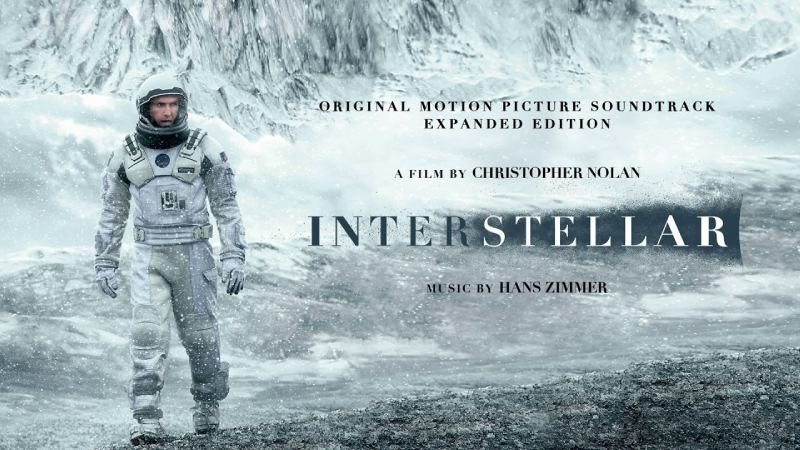

# 			《Web前端开发技术》课程项目报告

## 1.设计网站主题

网站为模仿IMDb和豆瓣的观影网站，网站包括以下几个功能

- 首页浏览信息

- 具体页面查看影片介绍

- 登录，注册

- 浏览他人发布的博客

footer在不同页面中有所差异，所以不单独解释代码，在使用部分有具体解释

导航栏只在首页中进行解释，不同页面中导航无明显变化

## 2.网站框架

### 2.1首页 (home page) [index.html](index.html)

首页包括以下内容

1. 导航
2. 热门影视信息
3. 当下热门榜单
4. 博客--2023年度回顾
5. 影视推荐
6. 版权信息

使用的css样式有color, text-decoration, font-family, font-size, background-color, margin,padding, line-height, list-style, height, width, border-radius, outline, position, transition, background, display, align-items, text-align,float, transition等


#### 1.导航（此处介绍，后面在其他网页中将不再介绍）<a name ="特点1"></a>

```html
<!--imdb导航栏开始-->
  <nav class="imdb1_up">
      <a href="index.html">
        </img>
      </a>
      <div class="imdb1_up_select">
        <a class="imdb1_up_select_character" id="Menu" href="">Menu</a>
        <input class="imdb1_up_select_character imdb1_up_select_search" placeholder="Search IMDb">
        <a href=""></a>
        <div class="imdb1_up_select_option">
          <ul>
            <li><a href="" id="imdb1_up_select_option_vip" class="imdb1_up_select_option_other">IMDbPro</a></li>
            <li>I</li>
            <li></li>
            <li><a href="" class="imdb1_up_select_option_other">WatchList</a></li>
            <li><a href="loginIn.html" class="imdb1_up_select_option_other">Sign In</a></li>
            <li><a href="" class="imdb1_up_select_option_other">EN</a></li>
          </ul>
        </div>
      </div>
  </nav>
  <!--imdb导航栏结束-->
```

在这段代码中将导航分为logo，主页以及其他功能按钮三个部分，通过超链接a实现导向功能。

并使用css对这些按钮进行hover响应，使用户操作更方便。

第一个部分为logo，使用img导入。

第二个部分为Menu，使用超链接a实现功能。

第三个部分为其他功能按钮，使用无序列表ul包裹，其中使用li>a实现跳转功能。

使用的CSS代码如下

```css

.imdb_color {
  background-color: black;
}

/*导航开始*/
.imdb1_up {
  width: 100%;
  height: 56px;
  background-color: rgb(13, 13, 13);
  margin: 0 auto;
}

.home {
  margin-left: 322px;
  margin-top: 9px;
}

.imdb1_up_select {
  width: 1502px;
  height: 46px;
  float: right;
}

.imdb1_up_select_character {
  line-height: 46px;
  text-decoration: none;
  color: black;
}

#Menu {
  font-family: "Roboto, Helvetica, Arial, sans-serif";
  font-size: 14px;
  color: white;
  position: relative;
  top: 3px;
  left: 21px;
  transition: border 0.3s ease;
}

#Menu:hover {
  border-radius: 10%;
  border: 3px solid rgb(31, 31, 31);
  border-width: 6px;
  background-color: rgb(31, 31, 31);
}

.imdb1_up_select_option_other {
  transition: border 0.3s ease;
}

.imdb1_up_select_option_other:hover {
  border-radius: 10%;
  border: 3px solid rgb(31, 31, 31);
  border-width: 6px;
  background-color: rgb(31, 31, 31);
}

#search {
  position: relative;
  background-color: white;
  left: -33px;
  top: 8px;
  width: 24px;
  height: 24px;
}

.imdb1_up_select_search {
  width: 720px;
  height: 30px;
  margin-left: 60px;
}

.imdb1_up_select_search:focus {
  outline: none;
  border-radius: 10px 10px;
}

.imdb1_up_select_option {
  position: relative;
  left: -73px;
  float: right;
  width: 600px;
  height: 31px;
}

.imdb1_up_select_option ul li {
  list-style: none; /*eliminate dot*/
  float: left;
  margin-left: 25px;
  line-height: 46px;
  text-decoration: none;
  color: white;
}

#imdb1_up_select_option_vip {
  color: aqua;
}

.imdb1_up_select_option img {
  position: relative;
  top: 4px;
  right: -22px;
  width: 20px;
  height: 20px;
}

.imdb1_up_select_option ul li a {
  font-family: "Franklin Gothic Medium", "Arial Narrow", Arial, sans-serif;
  font-size: 20px;
  color: white;
  text-decoration: none;
}
```


#### 2.热门影视信息 <a name ="特点2"></a>

该页面分为两个部分，为左边的轮播图（其他人喜欢观看的影片）和右边的即将更新的电视剧集。

左边的轮播图使用无序列表包裹六张图片（实际为五张不同图片，最后一张与第一张相同以实现轮播功能），使用无序列表包裹5个数字，以实现轮播图底下的图片顺序表现，以及两个标识（切换图片顺序）。

以下为实现左边功能的html代码

```html
<div class="imdb_color">
<div class="imdb2_forecast">
  <div class="imdb2_forecast_leftPicture">
    <ul id="imglist">
      <li></li>
      <li></li>
      <li></li>
      <li></li>
      <li></li>
      <li></li>
    </ul>
    <ul id="isolist">
      <li>1</li>
      <li>2</li>
      <li>3</li>
      <li>4</li>
      <li>5</li>

    </ul>
    <div class="prev">&lt;</div>
    <div class="next">></div>
  </div>
  <p id="imdb2_forecast_text">Others like</p>
```


实现轮播图的逻辑为以下几个函数

1. run函数

通过left向左滑动距离，timer计时。

当left正好走完五张图片时，将left置0，以实现无限滑动的效果，left每次移动10px，使用n判断left是否正好走完800px（也就是一张图片的距离时），若正好走完将n设置为1200ms（停留时间为1200ms），否则为10ms，然后通过timer使用timeout完成函数的循环。

```javascript
var left = 0;
var timer;
run();
function run() {
  //重复播放
  if (left <= -4000) {
    left = 0;
  }
  //m为当前图片编号
  var m = Math.floor(-left / 800);
  //向左移动
  isolistChange(m);
  imglist.style.marginLeft = left - 10 + "px";
  left -= 10;
  //如果正好一张图，就停多一点时间
  var n = left % 800 == 0 ? 1200 : 10;
  timer = setTimeout(run, n);
}

```

2. 定位函数

使用prev.onclick和next.onclick判断是否触发向前和向后的按钮，如果触发，通过Math函数获取当前图片的位置，然后向后+1或向前-1移动。注意判别是否为第一张和最后一张图片的特殊情况，此时需要改变移动位置，判断完成后通过调用imgChange(n)函数实现，这个函数将会传入第几张图片的序号，然后x800得到移动后的位置，并向左滑动这些距离。

```javascript
//图片定位
function imgchange(n) {
  let lt = -(n * 800);
  imglist.style.marginLeft = lt + "px";
  left = lt;
}

prev.onclick = function () {
  //获取当前位置，减去宽度就是前一张
  let prevgo = Math.floor(-left / 800) - 1;
  if (prevgo == -1) {
    prevgo = 5;
  }
  imgchange(prevgo);
};

next.onclick = function () {
  //获取当前位置，减去宽度就是前一张
  let nextgo = Math.floor(-left / 800) + 1;
  if (nextgo == 5) {
    nextgo = 0;
  }
  imgchange(nextgo);
};

```

 	3. 轮播图下方的顺序原点改变的实现

isolistChange函数会将所有列表的背景色清0，之后通过m判断当前图片位置，并将次图片背景色改为红色。isolistChange函数是将选择的原点的颜色改为红色。主要实现函数为eisolist.onclick函数，此函数判断用户点击的1，2，3，4，5中的哪一个数字，并将数字传给imgChange和isolistChange函数来达到改变原点颜色与改变图片位置的功能

```javascript
//图片定位
function imgchange(n) {
  let lt = -(n * 800);
  imglist.style.marginLeft = lt + "px";
  left = lt;
}
function isolistChange(m) {
  for (let index = 0; index < isolist.length; index++) {
    isolist[index].style.backgroundColor = "";
  }
  if (m < isolist.length) {
    isolist[m].style.backgroundColor = "red";
  }
}

eisolist.onclick = function () {
  var tar = event.target;
  let ico = tar.innerHTML - 1;
  imgchange(ico);
  isolistChange(ico);
};

```


右边部分即将更新的电视剧实现逻辑是使用div定位并设置好长高后，用无序表包裹实现三个img，三个超链接，来完成展示的功能

以下为实现右边即将更新的电视剧的代码

```html
<div class="imdb2_forecast_right">
    <p class="imdb2_forecast_right_describtion">
      Up next
    </p>
    <div class="imdb2_forecast_right_RightPicture">
      <ul class="imdb2_forecast_right_RightPicture_show">
        <li ><a href="https://www.imdb.com/video/vi1131661081/?listId=ls053181649&ref_=hp_hp_e_2" class="imdb2_forecast_right_RightPicture_show_text">'Rebel Moon: Part Two - The Scargiver'<br/>The Battle Continues</a></li>
        <li><a href="https://www.imdb.com/title/tt30007864/?ref_=nv_sr_srsg_0_tt_2_nm_0_q_%27The%2520American%2520Society%2520of%2520Magical%2520Negroes%27" class="imdb2_forecast_right_RightPicture_show_text">'The American Society of Magical Negroes'<br/>Watch the Trailer</a></li>
        <li><a href="https://www.imdb.com/title/tt30260619/" class="imdb2_forecast_right_RightPicture_show_text">5 Memorable TV Scenes of 2023<br/>Ted's Final Match and More</a></li>
      </ul>
      <a class="imdb2_forecast_right_RightPicture_more" href="">Browse trailers👉</a>
    </div>
  </div>
</div>
```


用css将ul设计为6个图片的宽度（4800px）并用overflow对超过的部分进行hidden即可实现轮播图的基本框架

实现第二部分的CSS代码如下

```css
/*预告开始*/
.imdb2_forecast {
  margin: 58px auto;
  background-color: black;
  width: 1264px;
  height: 548px;
}

#imdb2_forecast_text {
  position: absolute;
  top: 75px;
  font-size: 26px;
  color: rgb(245, 197, 24);
  font-family: "Trebuchet MS", "Lucida Sans Unicode", "Lucida Grande",
    "Lucida Sans", Arial, sans-serif;
  left: 330px;
}

/*实现轮播图*/
.imdb2_forecast_leftPicture {
  position: relative;
  width: 800px;
  height: 548px;
  cursor: pointer;
  overflow: hidden;
}

#isolist {
  position: absolute;
  right: 10px;
  bottom: 10px;
}

#isolist li {
  width: 30px;
  height: 30px;
  border-radius: 50%;
  background-color: #666;
  text-align: center;
  line-height: 30px;
  color: #fff;
  float: left;
  margin-left: 5px;
  cursor: pointer;
}

#imglist {
  text-decoration: none;
  width: 4800px;
  height: 548px;
}

.imdb2_forecast_leftPicture ul li img {
  width: 800px;
  height: 548px;
}

.imdb2_forecast_leftPicture ul li {
  float: left;
  list-style: none;
}

.prev,
.next {
  cursor: pointer;
  position: absolute;
  width: 30px;
  height: 40px;
  color: #fff;
  text-align: center;
  line-height: 40px;
  background-color: #666;
}

.prev {
  left: 5px;
  top: 45%;
}

.next {
  right: 5px;
  top: 45%;
}

/*实现结束*/
.imdb2_forecast_right {
  position: relative;
  top: -548px;
  width: 408px;
  height: 548px;
  float: right;
}

.imdb2_forecast_right_describtion {
  font-size: 24px;
  color: rgb(245, 197, 24);
  padding: 4px 0px;
  font-family: "Trebuchet MS", "Lucida Sans Unicode", "Lucida Grande",
    "Lucida Sans", Arial, sans-serif;
}

.imdb2_forecast_right_RightPicture {
  width: 407px;
  height: 454px;
  background-color: rgb(26, 26, 26);
}

.imdb2_forecast_right_RightPicture_show_text {
  text-decoration: none;
  color: white;
  font-size: 20px;
  margin-left: 15px;
  margin-top: 63px;
}

.imdb2_forecast_right_RightPicture_show_text:hover {
  color: yellow;
}

.imdb2_forecast_right_RightPicture_show_picture {
  position: relative;
  top: 1px;
  width: 90px;
  height: 128px;
  margin-left: 18px;
  margin-top: 5px;
}

.imdb2_forecast_right_RightPicture_show li {
  display: flex;
  align-items: center;
}

.imdb2_forecast_right_RightPicture_more {
  position: relative;
  left: 18px;
  top: 40px;
  text-decoration: none;
  font-size: 22px;
  color: white;
}

.imdb2_forecast_right_RightPicture_more:hover {
  color: aquamarine;
}

```


#### 3.当下热门榜单

该网页分为两个部分--左边榜单和右边榜单的，使用div定位后，对图片和超链接进行定位，之后插入内容即可完成。

html代码如下

```html
<div class="imdb3_today">
  <div class="imdb3_today1">
  <h3 class="imdb3_today_title">Featured today</h3>
</div>
  <div class="imdb3_today_post">
    <a href="blog.html"></a>
    <a href=""></a>
  </div>
  <div class="imdb3_today_description">
    <div class="imdb3_today_description_left">
      <a class="imdb3_today_description_left_text" href="blog.html">The Top Movies of 2023</a>
      <a class="imdb3_today_description_left_link" href="">See our worldwide top 10 lists</a>
    </div>
    <div class="imdb3_today_description_right">
      <a class="imdb3_today_description_right_text" href="">The Top TV Series of 2023</a>
      <a class="imdb3_today_description_right_link" href="">See our worldwide top 10 lists</a>
    </div>
  </div>

</div>
```


css代码如下

```css
.imdb3_today {
  margin: 63px, auto;
  background-color: black;
  height: 400px;
  width: 100%;
}

.imdb3_today_title {
  font-family: "Trebuchet MS", "Lucida Sans Unicode", "Lucida Grande",
    "Lucida Sans", Arial, sans-serif;
  margin-left: 336px;
  font-size: 40px;
  color: yellow;
}

.imdb3_today_post {
  width: 815px;
  height: 222px;
  margin-left: 336px;
  margin-top: 31px;
}

.imdb3_today_post_right {
  position: relative;
  top: 1px;
  left: 40px;
}

.imdb3_today_description {
  font-family: "Franklin Gothic Medium", "Arial Narrow", Arial, sans-serif;
  width: 815px;
  margin-top: 16px;
  margin-left: 337px;
  font-size: 16px;
}

.imdb3_today_description_left_text {
  text-align: left;
  text-decoration: none;
  color: aliceblue;
}

.imdb3_today_description_right_text {
  position: relative;
  top: -17px;
  left: 424px;
  text-decoration: none;
  color: aliceblue;
}

.imdb3_today_description_left_text:hover,
.imdb3_today_description_right_text:hover {
  text-decoration: underline;
}

.imdb3_today_description_left_link {
  position: relative;
  top: 37px;
  left: -170px;
  color: #5799ef;
  text-decoration: none;
}

.imdb3_today_description_right_link {
  position: relative;
  color: #5799ef;
  left: 239px;
  top: 19px;
  text-decoration: none;
}

.imdb3_today_description_left_link:hover,
.imdb3_today_description_right_link:hover {
  text-decoration: underline;
}

/**imdb今天结束/
```


#### 4.博客

实现逻辑为使用div将文字，图片定位后插入，并在图片上加入超链接，跳转到具体的blog网页。

html代码如下

```html
<!--imdb2023开始-->
<div class="imdb4_2023">
<div class="imdb4_2023_title">
  <a class= "imdb4_2023_title_link" href="">Best Of 2023 👉</a>
</div>
<div class="imdb4_2023_text">
  <p class="imdb4_2023_title_text">The year in review</p>
</div>
<div class="imdb4_2023_list">
  <ul >
    <li><a href="blog.html"></a></li>
    <li><a href=""></a></li>
    <li><a href=""></a></li>
  </ul>
</div>
</div>
```


css中使用到了渐变色彩和box-shadow使鼠标移动到图片上时更加美观

```css
/*imdb2023开始*/
.imdb4_2023 {
  margin: 28px auto;
  width: 1236px;
  height: 305px;
}

.imdb4_2023_title_link {
  font-family: Roboto, Helvetica, Arial, sans-serif;
  text-decoration: none;
  color: white;
  font-size: 30px;
}

.imdb4_2023_title_link:hover {
  color: #f5c518;
}

.imdb4_2023_title_text {
  color: #ffffffb3;
  margin-top: 16px;
  font-family: Roboto, Helvetica, Arial, sans-serif;
}

.imdb4_2023_list {
  margin: 24px auto;
  width: 1233px;
  height: 225px;
}

.imdb4_2023_list_picture1,
.imdb4_2023_list_picture2,
.imdb4_2023_list_picture3 {
  width: 393px;
  height: 219px;
  float: right;
}

.imdb4_2023_list_picture2,
.imdb4_2023_list_picture3 {
  margin-right: 24px;
  text-decoration: none;
}

.imdb4_2023_list_picture2 {
  position: relative;
  top: -21px;
  left: 0;
}

/*阴影盒子设置，首先是变化后的样子，圆框粉色*/
.imdb4_2023_list_picture2:hover,
.imdb4_2023_list_picture3:hover,
.imdb4_2023_list_picture1:hover {
  border-radius: 5%;
  box-shadow: -3px 3px 1px 1px rgba(255, 0, 128, 0.2);
}

/*阴影盒子设置，原先的样子，圆框蓝色，0.3s变化时间*/
.imdb4_2023_list_picture1,
.imdb4_2023_list_picture2,
.imdb4_2023_list_picture3 {
  transition: box-shadow 0.3s ease;
  border-radius: 5%;
  box-shadow: -3px 3px 1px 1px rgba(81, 151, 218, 0.2);
}

.imdb4_2023_list_picture3 {
  position: relative;
  left: 2px;
  top: -42px;
}

```


#### 5.观看推荐<a name ="特点3"></a>

此处使用div完成页面布局定位后，将图片和超链接插入，基础信息便完成了。此处还实现了将鼠标移动到图片上，弹出影片内容概况的功能（mask实现）。通过引入css特性opacity，transfrom和translate实现

html代码如下

```html
<!--imdb看什么开始-->
<div class="imdb5_WhatToWatch">
  <h3 class="imdb5_WhatToWatch_title">What to watch</h3>
<div class="imdb5_WhatToWatch_recommendations1">
  <a class="imdb5_WhatToWatch_recommendations" href="">
    Get more recommendations 👉
  </a>
</div>
<div class="imdb5_WhatToWatch_topPicks">
  
  <h3 class="imdb5_WhatToWatch_topPicks_title">Top picks ></h3>
</div>
<div class="imdb5_WhatToWatch_ForYou">
  <p class="imdb5_WhatToWatch_ForYou_text">TV shows and movies just for you</p>
</div>
<div class="imdb5_WhatToWatch_list">
  <div class="imdb5_WhatToWatch_list_up">
  <div class="imdb5_WhatToWatch_list_post">
    
    <div class="mask">
      <h3>Pulp Fiction</h3>
      <p>
        In a shadow-draped city, two uninvited guests slip into a dimly lit bar. Cold eyes scan the room like steel, and suddenly, a gunshot pierces the smoky air. A melancholy melody resonates in the corner as turbulent emotions surge through their veins. Destined to weave a bizarre and unique legend in the city's gritty underworld.</p>
    </div>
  </div>
  <div class="imdb5_WhatToWatch_list_post">
    
    <div class="mask">
      <h3>Se7en</h3>
      <p>Detectives Somerset and Mills chase a serial killer who uses the seven deadly sins as a gruesome motif. As the unsettling crimes escalate, the city's darkness becomes palpable. The shocking climax reveals a chilling philosophy. "Se7en," a riveting thriller, leaves an indelible mark, probing the depths of human depravity.</p></div>
  </div>
  <div class="imdb5_WhatToWatch_list_post">
    
    <div class="mask">
      <h3>Blade Runner</h3>
    <p>In a dystopian future, "Blade Runner" follows Deckard, a skilled replicant hunter, tasked with eliminating rogue bioengineered beings. As he navigates a neon-lit cityscape, moral ambiguity unfolds, questioning the essence of humanity. Ridley Scott's masterpiece explores identity, artificial intelligence, and the blurred lines between man and machine in a visually stunning and thought-provoking narrative.</p></div>
  </div>
  <div class="imdb5_WhatToWatch_list_post">
    
    <div class="mask">
      <h3>Taxi Driver</h3>
    <p>delves into the gritty streets of New York City, following Travis Bickle, a mentally unstable Vietnam War veteran turned cab driver. His descent into urban alienation and obsession with saving a young prostitute provides a haunting portrayal of loneliness and societal decay. Martin Scorsese's cinematic masterpiece captivates with its raw intensity and iconic performances.
    </p></div>

  </div>
  <div class="imdb5_WhatToWatch_list_post">
    
    <div class="mask">
      <h3>American Psycho</h3>
    <p>"American Psycho" unfolds the enigmatic life of Patrick Bateman, a wealthy New York investment banker harboring a dark and psychotic alter ego. Set against the backdrop of excess in the 1980s, the film delves into Bateman's disturbing descent into violence, blurring the lines between reality and delusion. This psychological thriller explores the veneer of sanity within the veneer of success.</p></div>

  </div>
  <div class="imdb5_WhatToWatch_list_post">
    
    <div class="mask">
      <h3>Pixels (2015)</h3>
    <p>"Pixels" is a sci-fi comedy where Earth is threatened by video game characters brought to life by extraterrestrial forces. A group of arcade champions, led by Adam Sandler and his quirky team, must use their gaming skills to save the world. Packed with nostalgia and pixelated chaos, the film blends humor and action for a lighthearted adventure through retro gaming elements.</p></div>

  </div>
</div>
<div class="imdb5_WhatToWatch_list_bottom">
  <!--post1-->
  <div class="imdb5_WhatToWatch_list_bottom_post">
    <div class="imdb5_WhatToWatch_list_bottom_star">💛8.9</div>
    <div class="imdb5_WhatToWatch_list_bottom_name"><a href="pulpFiction.html" class="imdb5_WhatToWatch_list_bottom_name1">Pulp Fiction</a></div>
    <div class="imdb5_WhatToWatch_list_bottom_watchlist"><a href="" class="imdb5_WhatToWatch_list_bottom_watchlist1">➕WatchList</a></div>
    <div class="imdb5_WhatToWatch_list_bottom_bottom">
      <div class="imdb5_WhatToWatch_list_bottom_bottom_left"><a href="" class="imdb5_WhatToWatch_list_bottom_bottom_left_trailer">Trailer</a>
    </div>
    <div class="imdb5_WhatToWatch_list_bottom_bottom_right">
      <a href="" class="imdb5_WhatToWatch_list_bottom_bottom_right_information_link"></a>
    </div>
    </div>
  </div>
  <!--post2-->
  <div class="imdb5_WhatToWatch_list_bottom_post">
    <div class="imdb5_WhatToWatch_list_bottom_star">💛8.6</div>
    <div class="imdb5_WhatToWatch_list_bottom_name"><a href="" class="imdb5_WhatToWatch_list_bottom_name1">Se7en</a></div>
    <div class="imdb5_WhatToWatch_list_bottom_watchlist"><a href="" class="imdb5_WhatToWatch_list_bottom_watchlist1">➕WatchList</a></div>
    <div class="imdb5_WhatToWatch_list_bottom_bottom">
      <div class="imdb5_WhatToWatch_list_bottom_bottom_left"><a href="" class="imdb5_WhatToWatch_list_bottom_bottom_left_trailer">Trailer</a>
    </div>
    <div class="imdb5_WhatToWatch_list_bottom_bottom_right">
      <a href="" class="imdb5_WhatToWatch_list_bottom_bottom_right_information_link"></a>
    </div>
    </div>
</div>
<!--post3-->
<div class="imdb5_WhatToWatch_list_bottom_post">
  <div class="imdb5_WhatToWatch_list_bottom_star">💛8.1</div>
  <div class="imdb5_WhatToWatch_list_bottom_name"><a href="" class="imdb5_WhatToWatch_list_bottom_name1">Blade Runner</a></div>
  <div class="imdb5_WhatToWatch_list_bottom_watchlist"><a href="" class="imdb5_WhatToWatch_list_bottom_watchlist1">➕WatchList</a></div>
  <div class="imdb5_WhatToWatch_list_bottom_bottom">
    <div class="imdb5_WhatToWatch_list_bottom_bottom_left"><a href="" class="imdb5_WhatToWatch_list_bottom_bottom_left_trailer">Trailer</a>
  </div>
  <div class="imdb5_WhatToWatch_list_bottom_bottom_right">
    <a href="" class="imdb5_WhatToWatch_list_bottom_bottom_right_information_link"></a>
  </div>
  </div>
</div>
<!--post4-->
<div class="imdb5_WhatToWatch_list_bottom_post">
  <div class="imdb5_WhatToWatch_list_bottom_star">💛8.2</div>
  <div class="imdb5_WhatToWatch_list_bottom_name"><a href="" class="imdb5_WhatToWatch_list_bottom_name1">Taxi  Driver</a></div>
  <div class="imdb5_WhatToWatch_list_bottom_watchlist"><a href="" class="imdb5_WhatToWatch_list_bottom_watchlist1">➕WatchList</a></div>
  <div class="imdb5_WhatToWatch_list_bottom_bottom">
    <div class="imdb5_WhatToWatch_list_bottom_bottom_left"><a href="" class="imdb5_WhatToWatch_list_bottom_bottom_left_trailer">Trailer</a>
  </div>
  <div class="imdb5_WhatToWatch_list_bottom_bottom_right">
    <a href="" class="imdb5_WhatToWatch_list_bottom_bottom_right_information_link"></a>
  </div>
  </div>
</div>
<!--post5-->
<div class="imdb5_WhatToWatch_list_bottom_post">
  <div class="imdb5_WhatToWatch_list_bottom_star">💛7.6</div>
  <div class="imdb5_WhatToWatch_list_bottom_name"><a href="" class="imdb5_WhatToWatch_list_bottom_name1">American Psycho</a></div>
  <div class="imdb5_WhatToWatch_list_bottom_watchlist"><a href="" class="imdb5_WhatToWatch_list_bottom_watchlist1">➕WatchList</a></div>
  <div class="imdb5_WhatToWatch_list_bottom_bottom">
    <div class="imdb5_WhatToWatch_list_bottom_bottom_left"><a href="" class="imdb5_WhatToWatch_list_bottom_bottom_left_trailer">Trailer</a>
  </div>
  <div class="imdb5_WhatToWatch_list_bottom_bottom_right">
    <a href="" class="imdb5_WhatToWatch_list_bottom_bottom_right_information_link"></a>
  </div>
  </div>
</div>
<!--post6--><div class="imdb5_WhatToWatch_list_bottom_post">
    <div class="imdb5_WhatToWatch_list_bottom_star">💛5.6</div>
    <div class="imdb5_WhatToWatch_list_bottom_name"><a href="" class="imdb5_WhatToWatch_list_bottom_name1">PIXELS</a></div>
    <div class="imdb5_WhatToWatch_list_bottom_watchlist"><a href="" class="imdb5_WhatToWatch_list_bottom_watchlist1">➕WatchList</a></div>
    <div class="imdb5_WhatToWatch_list_bottom_bottom">
      <div class="imdb5_WhatToWatch_list_bottom_bottom_left"><a href="" class="imdb5_WhatToWatch_list_bottom_bottom_left_trailer">Trailer</a>
    </div>
    <div class="imdb5_WhatToWatch_list_bottom_bottom_right">
      <a href="" class="imdb5_WhatToWatch_list_bottom_bottom_right_information_link"></a>
    </div>
    </div>
</div>
  </div>
</div>
</div>
<!--imdb看什么结束-->

```


这段代码为定义一个class-mask，将它定位在图片的位置，开始时将其opacity（透明度）定义为0（即隐形），并进行使用transform:scale(0.1)缩小至0.1倍，保持看不到的情况；将图片定义为transform(1)即原大小，opacity定义为1-完全可见。当鼠标移动到它们的父类div后，使用transform将图片opacity改为0，缩小scale至0.1，将mask恢复为原大小，并将opacity改为1，同时使用transition将变化过程使用线性方式ease在0.5s内完成过渡，使用户感觉更加自然。

以下CSS代码为此处实现的难点

```css
/*实现简报*/
.imdb5_WhatToWatch_list_post_picture {
  width: 182px;
  height: 275px;
  transition: all 0.5s ease-in-out;
  transform: scaleY(1);
}

.mask {
  width: 182px;
  height: 275px;
  position: absolute;
  top: 1687px;
  transform: scale(0.3);
  transition: all 0.5s ease;
  opacity: 0;
  border-radius: 5px;
  text-align: left;
  background-color: rgba(179, 176, 176, 0.5);
}

.mask h3 p {
  opacity: 0;
  transform: scale(0);
}

.mask h3 {
  text-transform: uppercase;
  width: 100%;
  text-align: center;
  font-size: 20px;
  color: aliceblue;
}

.mask p {
  font-family: "Times New Roman", Times, serif;
  overflow: hidden;
  width: 100%;
  font-size: 14px;
  color: aliceblue;
}

.mask:hover {
  transform: scale(1);
  opacity: 1;
}

/*注意 是选中父类后发生变化！！！*/
.imdb5_WhatToWatch_list_post:hover .mask {
  transform: scale(1);
  opacity: 1;
}

.imdb5_WhatToWatch_list_post:hover .imdb5_WhatToWatch_list_post_picture {
  transform: scale(0.1);
  opacity: 0;
}
```


以下为整个部分的css实现代码

```css
*imdb看什么开始*/
.imdb5_WhatToWatch {
  width: 1232px;
  height: 622px;
  margin: 55px auto;
}

.imdb5_WhatToWatch_title {
  font-family: Roboto, Helvetica, Arial, sans-serif;
  color: yellow;
  font-size: 2rem;
  font-weight: 500;
  line-height: 2.5rem;
}

.imdb5_WhatToWatch_recommendations1 {
  margin-top: -30px;
  width: 280px;
  height: 14px;
  float: right;
}

.imdb5_WhatToWatch_recommendations {
  text-decoration: none;
  color: #f1f5fa;
  transition: border 0.2s ease;
}

.imdb5_WhatToWatch_recommendations:hover {
  border-radius: 5%;
  border: 1px solid rgb(53, 52, 52);
  border-width: 6px;
  background-color: rgb(53, 52, 52);
}

.imdb5_WhatToWatch_topPicks_img {
  width: 40px;
  height: 40px;
  position: relative;
  top: 15px;
  left: 1px;
}

.imdb5_WhatToWatch_topPicks {
  width: 255px;
  height: 55px;
  position: relative;
  top: 8px;
  float: left;
}

.imdb5_WhatToWatch_topPicks_title {
  position: relative;
  top: -25px;
  left: 33px;
  padding-left: 0.75rem;
  max-height: 2.4em;
  color: white;
  font-size: 23px;
}

.imdb5_WhatToWatch_ForYou {
  margin-top: 73px;
  width: 1232px;
  height: 23px;
}

.imdb5_WhatToWatch_ForYou_text {
  color: hsla(0, 0%, 100%, 0.7);
  font-family: Roboto, Helvetica, Arial, sans-serif;
  line-height: 1.5rem;
  font-weight: 400;
  font-size: 1rem;
  letter-spacing: 0.03125em;
}

.imdb5_WhatToWatch_list {
  width: 1232px;
  height: 476px;
  margin-right: auto;
  margin-left: auto;
}

.imdb5_WhatToWatch_list_post {
  float: left;
  width: 182px;
  height: 275px;
  margin-right: 20px;
  margin-top: 20px;
}

/*实现简报*/
.imdb5_WhatToWatch_list_post_picture {
  width: 182px;
  height: 275px;
  transition: all 0.5s ease-in-out;
  transform: scaleY(1);
}

.mask {
  width: 182px;
  height: 275px;
  position: absolute;
  top: 1687px;
  transform: scale(0.3);
  transition: all 0.5s ease;
  opacity: 0;
  border-radius: 5px;
  text-align: left;
  background-color: rgba(179, 176, 176, 0.5);
}

.mask h3 p {
  opacity: 0;
  transform: scale(0);
}

.mask h3 {
  text-transform: uppercase;
  width: 100%;
  text-align: center;
  font-size: 20px;
  color: aliceblue;
}

.mask p {
  font-family: "Times New Roman", Times, serif;
  overflow: hidden;
  width: 100%;
  font-size: 14px;
  color: aliceblue;
}

.mask:hover {
  transform: scale(1);
  opacity: 1;
}

/*注意 是选中父类后发生变化！！！*/
.imdb5_WhatToWatch_list_post:hover .mask {
  transform: scale(1);
  opacity: 1;
}

.imdb5_WhatToWatch_list_post:hover .imdb5_WhatToWatch_list_post_picture {
  transform: scale(0.1);
  opacity: 0;
}

.imdb5_WhatToWatch_list_bottom {
  width: 1232px;
  height: 200px;
  margin-top: 22px;
}

.imdb5_WhatToWatch_list_bottom_post {
  background-color: rgb(26, 26, 26);
  height: 200px;
  width: 182px;
  margin-right: 20px;
  float: left;
}

.imdb5_WhatToWatch_list_bottom_star {
  width: 181.5px;
  height: 16px;
  margin-top: 20px;
  color: hsla(0, 0%, 100%, 0.7);
}

.imdb5_WhatToWatch_list_bottom_name {
  width: 181.5px;
  height: 18px;
  margin-top: 18px;
}

.imdb5_WhatToWatch_list_bottom_name1 {
  text-decoration: none;
  margin-left: 2px;
  font-size: 18px;
  font-family: Roboto, Helvetica, Arial, sans-serif;
  text-decoration: none;
  color: white;
}

.imdb5_WhatToWatch_list_bottom_name1:hover {
  text-decoration: underline;
}

.imdb5_WhatToWatch_list_bottom_watchlist {
  width: 181.5px;
  height: 15px;
  margin: 30px auto;
}

.imdb5_WhatToWatch_list_bottom_watchlist1 {
  text-decoration: none;
  color: #5799ef;
  border-radius: 5px;
  width: 84px;
  height: 14px;
  margin-left: 30px;
  border: 4px solid rgb(34, 34, 34);
  border-width: 9px;
  background-color: rgb(34, 34, 34);
}

.imdb5_WhatToWatch_list_bottom_watchlist1:hover {
  color: #5799ef;
  border-radius: 8%;
  border: 4px solid rgb(58, 57, 57);
  border-width: 9px;
  background-color: rgb(58, 57, 57);
}

.imdb5_WhatToWatch_list_bottom_bottom_left {
  width: 72px;
  height: 50px;
  float: left;
}

.imdb5_WhatToWatch_list_bottom_bottom_left_trailer {
  width: 59px;
  height: 18px;
  float: right;
  line-height: 18px;
  margin: 12px auto;
  text-decoration: none;
  font-size: 18px;
  color: white;
  font-family: Roboto, Helvetica, Arial, sans-serif;
}

.imdb5_WhatToWatch_list_bottom_bottom_left_trailer:hover {
  border-radius: 10%;
  border: 1px solid rgb(53, 52, 52);
  border-width: 6px;
  background-color: rgb(53, 52, 52);
}

.imdb5_WhatToWatch_list_bottom_bottom_right {
  margin-left: 127px;
  margin-top: 23px;
  height: 48px;
  width: 48px;
}

.imdb5_WhatToWatch_list_bottom_bottom_right_information {
  width: 25px;
  height: 25px;
  margin: 8px 8px;
  line-height: 24px;
}

.imdb5_WhatToWatch_list_bottom_bottom_right_information:hover {
  border-radius: 50%;
  background-color: rgb(53, 52, 52);
  padding: 5px;
}

```


#### 6.版权信息（footer）

此处使用灰底白字使版权信息更加明显

html代码如下

```html
<!--imdbCOPYRIGHT-->
<div class="imdb6_copyright">
  <p class="imdb6_copyright_right">© 1990-2023 by IMDb.com, Inc.</p>
</div>
```


css代码如下

```css
/*imdb COPYRIGHT*/
.imdb6_copyright {
  margin-top: 200px;
  width: 100%;
  height: 50px;
  background-color: rgb(26, 26, 26);
  font-size: 12px;
}

.imdb6_copyright_right {
  line-height: 50px;
  text-align: center;
  color: white;
}

```


### 2.2登录/注册界面[loginIn.html](loginIn.html)<a name ="特点4"></a>

此处使用js实现登录/注册动态切换，故只使用了一个网页完成

#### 1.背景实现

背景调用了css-doodle，网站https://cdnjs.cloudflare.com/ajax/libs/css-doodle/0.37.4/css-doodle.min.js 实现创建粒子的功能，并使用css为粒子添加动画效果。

使用的css样式有color, text-decoration, font-family, font-size, background-color, margin,padding, line-height, list-style, height, width, border-radius, outline, position, transition, background, display, align-items, text-align,float, transition, zoom等

以下为css代码

此处使用css-doodle 完成了一个在网页可见范围内生成44x44个例子的功能，在top，left中使用随机函数@r使粒子位置随机生成，background使用@r随机生成颜色，在transform中使用@r使粒子的运动轨迹，旋转角度不同，通过对animation的改变实现粒子运动速度的改变，并将动画时间定义为在-10-0之间，然后使用zoom（与translate相比，更简单的方式）使粒子的大小改变，然后为粒子加上阴影修饰，使登录界面更加美观。

```css
<!--background-->
  <css-doodle grid="44x44">
    :doodle {
        @size: 100vw 100vmin;
    }
    
    position: absolute;
    <!--随机位置-->
    top: @r(1%, 100%, 1.5);
    left: @r(1%, 100%, 1.5);
    width: 2px;
    height: 2px;
    background: #000;
    border-radius: 50%;
    <!--实现随机颜色-->
    background: hsl(@r(200, 255, 3), @r(70%, 90%), @r(70%, 90%));
    <!--随机旋转角度和移动方向-->
    transform: rotate(@r(360deg)) translate(@r(-50, 50)vmin, @r(-50, 50)vmin);
    <!--实现动画随机效果，使帧不同-->
    animation: move 10s infinite @r(-10, 0)s @p(linear, ease-in, ease-in-out) alternate;
    <!--实现随机大小-->
    zoom: @rn(.1, 5, 3);
    box-shadow: 0 0 1px #fff, 0 0 3px #fff;
    @keyframes move {
        100% {
            transform: rotate(0) translate(0, 0);
        }
      }
</css-doodle>
```

#### 2.登录界面上实现

通过使用input实现基本界面信息

```html
<div class="Sign_In">
    <h2 class="title">Sign In</h2>
    <input type="text" id="Sign_In_name" placeholder="Username">
    <input type="password" id="Sign_In_password" placeholder="Password">
    <input type="submit" value="sign in" id="Sign_In_submit">
    <div class="footer">
      <div class="Remember">
        <input type="checkbox"  id="remember" >
        <!--复选框-->
        <label for="remember">remember</label>
      </div>
      <button id="Sign_up">sign up</button>
    </div>
```


然后使用css，通过display:flex 和flex-direction 实现从上往下的数列排列模式，并对输入框进行大小和距离调整实现功能。

以下为css代码

```css

/*Sign*/
.Sign_In {
  display: flex;
  flex-direction: column;
  position: absolute;
  top: 220px;
  left: 750px;
  width: 350px;
  height: 450px;
  background-color: #ffffff49;
  border-radius: 50px;
  /*元素的内部底部添加一个具有白色、半透明且模糊的阴影*/
  box-shadow: 0 0 30px rgba(255, 255, 255, 0.5) inset;
}

.title {
  font-size: 80px;
  text-align: center;
  margin-bottom: 30px;
  color: #fff;
  text-shadow: 0 0 10px #ff9dff80;
}

input[type="text"],
input[type="password"] {
  width: 100%;
  height: 50px;
  margin: 10px 0;
  box-sizing: border-box;
  color: rgb(0, 0, 0);
  border: 5px solid transparent;
  background: rgba(255, 255, 255, 0.5);
  border-radius: 100px;
  padding: 5px 20px 0 20px;
  transition: 0.3s;
  font-size: 18px;
  outline: none;
}

input[type="text"],
input[type="password"] {
  background: rgba(255, 255, 255, 0);
  border: 5px solid #ffffff;
}

input[type="submit"] {
  width: 100%;
  height: 50px;
  padding: 10px;
  margin: 15px 0;
  border-radius: 100px;
  border: none;
  background-color: #007bff;
  color: #fff;
  cursor: pointer;
  font-size: 20px;
  letter-spacing: 3px;
}

input::placeholder {
  color: #394d8a;
}

.footer {
  display: flex;
  justify-content: space-between;
  align-items: center;
  width: 100%;
  margin-top: 20px;
}

.Remember {
  opacity: 1;
  display: flex;
  justify-content: center;
  align-items: center;
  font-size: 18px;
  color: #7597ff;
  margin-left: 20px;
}

#remember {
  display: block;
  width: 25px;
  height: 25px;
  margin-right: 10px;
  color: #007bff;
}

#Sign_up {
  margin-right: 20px;
  border: none;
  background-color: #ffffff00;
  color: #7597ff;
  font-size: 18px;
}

```


接着对这个页面使用js调整，使其能够同时注册和登录

使用js对用户点击的是登录还是注册进行判断，如果点击的是登录则将输入框中的placeholder定义为username和password；如果点击的是注册则改为new username和new password，并通过对remember的opacity改变，将其变为不可见，完成注册时记住密码功能的消失

js代码如下

```javascript
document.getElementById("Sign_up").addEventListener("click", function () {
  var title = document.querySelector(".title");
  var login = document.getElementById("Sign_In_submit");
  var rememberlabel = document.querySelector(".Remember");
  var sign = document.getElementById("Sign_up");
  if (title.innerText === "Sign In") {
    title.innerText = "Sign Up";
    login.value = "Sign Up";
    rememberlabel.style.opacity = "0";
    sign.innerText = "Sign in";
    document.getElementById("Sign_In_name").value = "";
    document.getElementById("Sign_In_password").value = "";
    document.getElementById("Sign_In_name").placeholder = "new Username";
    document.getElementById("Sign_In_password").placeholder = "new Password";
    document.getElementById("Sign_In_password").type = "password";
  } else {
    title.innerText = "Sign In";
    login.value = "Sign In";
    rememberlabel.style.opacity = "1";
    sign.innerText = "Sign up";
    document.getElementById("Sign_In_name").value = "";
    document.getElementById("Sign_In_password").value = "";
    document.getElementById("Sign_In_name").placeholder = "Username";
    document.getElementById("Sign_In_password").placeholder = "Password";
    document.getElementById("Sign_In_name").type = "password";
  }
});

```


### 2.3 blog的实现[blog.html](blog.html)

此处页面较多使用svg进行图标的调用，使页面更加美观。

使用的css样式有color, text-decoration, font-family, font-size, background-color, margin,padding, line-height, list-style, height, width, border-radius, outline, position, transition, background, display, align-items, text-align,float, transition等

此部分内容为

- blog主题
- 影片图片以及内容介绍
- blog内容
- 发布日期，时间，作者

#### 1.blog主题<a name ="特点5"></a>

此部分分为4个板块

1. 大标题和赞助商

此处使用svg和div定位插入文字实现，svg能够调用设计美观的logo图标

html代码如下

```html
<div class="blog1_up">
    <div class="blog1_up_left">
        <svg viewBox="0 0 604 268" fill="none" xmlns="http://www.w3.org/2000/svg"><title>Best of 2023</title><path d="M93.8802 66.26C93.8802 84.11 81.4502 94.03 56.8502 94.03H5.41016V1.45996H56.5902C81.5802 1.45996 92.5602 10.72 92.5602 25C92.5602 36.11 86.8702 41.66 78.5402 45.76C87.2702 49.07 93.8802 54.49 93.8802 66.26ZM57.2502 31.22C57.2502 26.99 54.6002 24.74 49.7102 24.74H41.9102V37.7H49.7102C54.6002 37.7 57.2502 35.45 57.2502 31.22ZM57.2502 64.28C57.2502 60.05 54.6002 57.8 49.7102 57.8H41.9102V70.76H49.7102C54.6002 70.76 57.2502 68.51 57.2502 64.28Z" fill="white"></path><path d="M180.24 94.03H100.36V1.45996H179.97V27.12H136.72V35.05H167.67V60.31H136.72V68.38H180.23V94.04L180.24 94.03Z" fill="white"></path><path d="M270.83 63.74C270.83 87.94 251.79 95.48 228.38 95.48C212.25 95.48 197.17 92.31 184.08 87.02L193.73 60.97C208.28 66.52 220.18 68.51 227.59 68.51C232.48 68.51 233.41 67.72 233.41 66.39C233.41 65.33 233.01 64.54 222.3 61.89C196.51 55.54 186.86 47.74 186.86 31.74C186.86 7.54 205.77 0 229.58 0C245.19 0 257.75 3.57 269.92 8.99L259.6 34.78C249.15 29.75 238.31 26.98 229.45 26.98C225.09 26.98 224.29 27.91 224.29 29.1C224.29 30.29 224.29 31.22 234.08 33.6C258.81 39.55 270.84 47.22 270.84 63.75L270.83 63.74Z" fill="white"></path><path d="M357.72 31.08H334.44V94.03H296.35V31.08H273.07V1.45996H357.71V31.08H357.72Z" fill="white"></path><path d="M504.52 47.74C504.52 81.73 483.36 95.48 457.18 95.48C431 95.48 409.84 81.73 409.84 47.74C409.84 13.75 430.99 0 457.17 0C483.35 0 504.51 13.75 504.51 47.74H504.52ZM467.49 47.74C467.49 30.95 462.6 27.11 457.17 27.11C451.74 27.11 446.86 30.94 446.86 47.74C446.86 64.54 451.75 68.37 457.17 68.37C462.59 68.37 467.49 64.54 467.49 47.74Z" fill="white"></path><path d="M592.34 29.76H550.29V38.36H580.18V65.74H550.29V94.04H512.73V1.45996H592.34V29.76Z" fill="white"></path><path d="M149.52 265.32H1.26007C2.85007 204.83 29.23 179.37 78.8 161.63C87.67 158.45 89.72 157.31 89.72 154.58C89.72 151.85 88.3501 150.49 80.4001 150.49C64.4801 150.49 43.3401 157.09 24.4601 168.45L0.810059 126.15C26.9601 111.14 49.7001 103.64 79.2601 103.64C126.78 103.64 148.39 121.37 148.39 150.03C148.39 176.41 134.52 188.91 101.32 203.24C85.6301 209.84 79.04 213.7 72.67 219.61H149.53V265.32H149.52Z" fill="white"></path><path d="M451.22 265.32H302.96C304.55 204.83 330.93 179.37 380.5 161.63C389.37 158.45 391.42 157.31 391.42 154.58C391.42 151.85 390.05 150.49 382.1 150.49C366.18 150.49 345.04 157.09 326.16 168.45L302.51 126.15C328.66 111.14 351.4 103.64 380.96 103.64C428.48 103.64 450.09 121.37 450.09 150.03C450.09 176.41 436.22 188.91 403.02 203.24C387.33 209.84 380.74 213.7 374.37 219.61H451.23V265.32H451.22Z" fill="white"></path><path d="M603.16 215.98C603.16 251.22 576.1 267.82 530.85 267.82C499.24 267.82 474.46 262.36 451.95 246.9L476.96 207.33C492.2 216.42 508.57 221.2 524.94 221.2C539.49 221.2 545.86 218.7 545.86 213.02C545.86 207.34 541.08 205.74 530.4 205.74H499.47V163.9H525.17C535.63 163.9 539.04 161.86 539.04 156.85C539.04 152.3 533.81 150.03 523.58 150.03C509.48 150.03 495.84 153.21 479.69 161.85L454.9 124.33C477.18 110.46 498.1 103.64 528.12 103.64C574.28 103.64 598.61 117.74 598.61 147.53C598.61 163.22 590.65 173.45 576.33 179.59C592.7 185.73 603.16 195.51 603.16 215.97V215.98Z" fill="white"></path><path d="M231.08 265.26C276.047 265.26 312.5 228.807 312.5 183.84C312.5 138.873 276.047 102.42 231.08 102.42C186.113 102.42 149.66 138.873 149.66 183.84C149.66 228.807 186.113 265.26 231.08 265.26Z" fill="#FF00EA"></path><path d="M245.13 251.67C282.52 251.67 312.83 221.36 312.83 183.97C312.83 146.58 282.52 116.27 245.13 116.27C207.741 116.27 177.43 146.58 177.43 183.97C177.43 221.36 207.741 251.67 245.13 251.67Z" fill="white"></path></svg>
    </div>
    <div class="blog1_up_right">
        <div class="blog1_up_right_text">Sponsored by</div>
        <div class="blog1_up_right_main_text">Disney+</div>
    </div>
</div>
```

css代码如下

```css

.blog1_up {
  margin-top: 36px;
  margin-bottom: 120px;
  margin-left: 335px;
  width: 195px;
  height: 42px;
}

.blog1_up_left {
  width: 92px;
  height: 42px;
}

.blog1_up_right {
  position: absolute;
  top: 91px;
  left: 453px;
  width: 106px;
  height: 34px;
  color: white;
}

.blog1_up_right_text {
  font-size: calc(0.75em);
  margin-bottom: 0.25em;
}

.blog1_up_right_main_text {
  font-size: 1rem;
}

```

2. 小标题的实现

主要调用svg实现

html 代码如下

```html
<div class="blog2_title">
    <svg  width="717" height="211" viewBox="0 0 717 211" fill="none" xmlns="http://www.w3.org/2000/svg" class="blog2_title_main"><g clip-path="url(#clip0_546_460)"><path d="M73.03 26.81H52.95V81.12H20.08V26.81H0V1.26001H73.03V26.82V26.81Z" fill="white"></path><path d="M154.04 41.19C154.04 70.52 135.78 82.38 113.19 82.38C90.6001 82.38 72.3401 70.51 72.3401 41.19C72.3401 11.87 90.6001 0 113.19 0C135.78 0 154.04 11.87 154.04 41.19ZM122.09 41.19C122.09 26.7 117.87 23.39 113.19 23.39C108.51 23.39 104.29 26.7 104.29 41.19C104.29 55.68 108.51 58.99 113.19 58.99C117.87 58.99 122.09 55.68 122.09 41.19Z" fill="white"></path><path d="M231.18 30.81C231.18 51.58 217.37 60.36 194.1 60.36H190.22V81.13H158.27V1.26001H194.1C217.38 1.26001 231.18 10.05 231.18 30.81ZM201.28 30.81C201.28 25.9 198.31 23.51 192.61 23.51H189.64V38.12H192.61C198.32 38.12 201.28 35.72 201.28 30.82V30.81Z" fill="white"></path><path d="M361.6 81.13H332.39V50.44C332.39 48.27 332.62 43.82 332.73 40.86C331.7 46.45 329.65 54.44 327.71 60.83L321.66 81.14H311.39L305.34 60.83C303.4 54.44 301.35 46.45 300.32 40.86C300.43 43.83 300.66 48.28 300.66 50.44V81.13H271.45V1.26001H307.16L311.38 15.29C314 24.08 316.17 31.15 316.63 36.86C317.09 31.15 319.25 23.97 321.88 15.29L326.1 1.26001H361.59V81.13H361.6Z" fill="white"></path><path d="M447.52 41.19C447.52 70.52 429.26 82.38 406.67 82.38C384.08 82.38 365.82 70.51 365.82 41.19C365.82 11.87 384.08 0 406.67 0C429.26 0 447.52 11.87 447.52 41.19ZM415.57 41.19C415.57 26.7 411.35 23.39 406.67 23.39C401.99 23.39 397.77 26.7 397.77 41.19C397.77 55.68 401.99 58.99 406.67 58.99C411.35 58.99 415.57 55.68 415.57 41.19Z" fill="white"></path><path d="M526.48 1.26001L501.15 81.13H468.29L442.96 1.26001H475.02L479.58 20.66C482.32 32.18 484.26 42.45 484.83 50.44C485.4 42.45 487.34 32.18 490.08 20.66L494.64 1.26001H526.47H526.48Z" fill="white"></path><path d="M561.51 81.13H528.65V1.26001H561.51V81.13Z" fill="white"></path><path d="M636.25 81.13H567.33V1.26001H636.02V23.4H598.71V30.25H625.41V52.04H598.71V59H636.25V81.14V81.13Z" fill="white"></path><path d="M711.56 55C711.56 75.88 695.13 82.38 674.93 82.38C661.01 82.38 648 79.64 636.7 75.08L645.03 52.6C657.58 57.39 667.85 59.1 674.24 59.1C678.46 59.1 679.26 58.42 679.26 57.27C679.26 56.36 678.92 55.67 669.68 53.39C647.43 47.91 639.1 41.18 639.1 27.37C639.1 6.48998 655.42 -0.0200195 675.96 -0.0200195C689.42 -0.0200195 700.26 3.05998 710.76 7.73998L701.86 29.99C692.85 25.65 683.49 23.26 675.84 23.26C672.07 23.26 671.39 24.06 671.39 25.09C671.39 26.12 671.39 26.92 679.83 28.97C701.17 34.1 711.55 40.72 711.55 54.99L711.56 55Z" fill="white"></path><path d="M119.54 151.25C119.54 193.56 93.1999 210.68 60.5999 210.68C27.9999 210.68 1.66992 193.56 1.66992 151.25C1.66992 108.94 28.0099 91.8199 60.6099 91.8199C93.2099 91.8199 119.55 108.94 119.55 151.25H119.54ZM73.4399 151.25C73.4399 130.34 67.3499 125.57 60.5999 125.57C53.8499 125.57 47.7599 130.34 47.7599 151.25C47.7599 172.16 53.8499 176.93 60.5999 176.93C67.3499 176.93 73.4399 172.16 73.4399 151.25Z" fill="white"></path><path d="M224.74 128.86H172.39V139.56H209.6V173.64H172.39V208.87H125.64V93.6299H224.75V128.86H224.74Z" fill="white"></path><path d="M388.04 208.87H280.7C281.85 165.08 300.95 146.64 336.84 133.8C343.26 131.5 344.74 130.67 344.74 128.7C344.74 126.73 343.75 125.74 337.99 125.74C326.47 125.74 311.16 130.52 297.49 138.75L280.37 108.13C299.3 97.26 315.76 91.83 337.17 91.83C371.58 91.83 387.22 104.67 387.22 125.41C387.22 144.51 377.18 153.56 353.14 163.93C341.78 168.71 337.01 171.5 332.4 175.78H388.04V208.87Z" fill="white"></path><path d="M502.62 151.25C502.62 193.56 475.46 210.68 445.82 210.68C416.18 210.68 389.02 193.56 389.02 151.25C389.02 108.94 416.18 91.8199 445.82 91.8199C475.46 91.8199 502.62 108.94 502.62 151.25ZM458.5 151.25C458.5 129.68 452.41 125.24 445.82 125.24C439.23 125.24 433.14 129.69 433.14 151.25C433.14 172.81 439.23 177.26 445.82 177.26C452.41 177.26 458.5 172.81 458.5 151.25Z" fill="white"></path><path d="M606.47 208.87H499.13C500.28 165.08 519.38 146.64 555.27 133.8C561.69 131.5 563.17 130.67 563.17 128.7C563.17 126.73 562.18 125.74 556.42 125.74C544.9 125.74 529.59 130.52 515.92 138.75L498.8 108.13C517.73 97.26 534.19 91.83 555.6 91.83C590.01 91.83 605.65 104.67 605.65 125.41C605.65 144.51 595.61 153.56 571.57 163.93C560.21 168.71 555.44 171.5 550.83 175.78H606.47V208.87Z" fill="white"></path><path d="M716.47 173.15C716.47 198.67 696.88 210.68 664.12 210.68C641.24 210.68 623.29 206.73 606.99 195.54L625.1 166.9C636.13 173.48 647.98 176.94 659.84 176.94C670.38 176.94 674.99 175.13 674.99 171.01C674.99 166.89 671.53 165.74 663.8 165.74H641.41V135.45H660.01C667.58 135.45 670.05 133.97 670.05 130.35C670.05 127.06 666.26 125.41 658.86 125.41C648.65 125.41 638.78 127.71 627.09 133.97L609.15 106.81C625.28 96.77 640.43 91.83 662.16 91.83C695.58 91.83 713.19 102.04 713.19 123.6C713.19 134.96 707.43 142.37 697.06 146.81C708.91 151.26 716.49 158.34 716.49 173.15H716.47Z" fill="white"></path></g><defs><clipPath id="clip0_546_460"><rect width="716.47" height="210.68" fill="white"></rect></clipPath></defs></svg>
    <div class="blog2_title_line"></div>
        <svg width="450" height="52" viewBox="0 0 450 52" fill="none" xmlns="http://www.w3.org/2000/svg" class="blog2_title_text"><path d="M46.944 0.791998H61.2L49.176 51.192H36.288L33.984 40.248C32.328 32.472 30.816 23.04 30.528 19.368C30.24 23.04 28.728 32.472 27.072 40.248L24.768 51.192H12.024L0 0.791998H14.4L15.768 9.216C16.92 16.344 18.288 25.128 18.792 31.104C19.368 25.2 21.096 16.488 22.536 9.288L24.264 0.791998H37.08L38.808 9.288C40.248 16.488 41.976 25.2 42.552 31.104C43.056 25.128 44.424 16.344 45.576 9.216L46.944 0.791998Z" fill="white"></path><path d="M88.938 0C102.618 0 112.194 9.144 112.194 25.92C112.194 42.696 102.474 51.984 88.794 51.984C75.114 51.984 65.538 42.84 65.538 26.064C65.538 9.288 75.258 0 88.938 0ZM88.938 39.816C94.554 39.816 97.722 35.136 97.722 26.064C97.722 16.992 94.41 12.168 88.794 12.168C83.178 12.168 80.01 16.848 80.01 25.92C80.01 34.992 83.322 39.816 88.938 39.816Z" fill="white"></path><path d="M142.32 23.184C146.856 23.184 148.656 21.168 148.656 17.568C148.656 14.4 146.928 12.168 142.536 12.168H134.112V23.184H142.32ZM153.48 31.968L163.56 51.192H147.936L139.728 34.2H134.112V51.192H120.36V0.791998H142.896C154.704 0.791998 162.552 5.256 162.552 17.208C162.552 24.768 159.024 29.448 153.48 31.968Z" fill="white"></path><path d="M208.331 39.024V51.192H171.899V0.791998H186.011V39.024H208.331Z" fill="white"></path><path d="M233.836 0.791998C249.676 0.791998 259.756 6.768 259.756 25.704C259.756 44.64 250.396 51.192 232.54 51.192H216.196V0.791998H233.836ZM233.332 39.24C242.044 39.24 245.428 35.928 245.428 25.92C245.428 16.632 242.476 12.744 233.764 12.744H230.308V39.24H233.332Z" fill="white"></path><path d="M311.178 0.791998H325.434L313.41 51.192H300.522L298.218 40.248C296.562 32.472 295.05 23.04 294.762 19.368C294.474 23.04 292.962 32.472 291.306 40.248L289.002 51.192H276.258L264.234 0.791998H278.634L280.002 9.216C281.154 16.344 282.522 25.128 283.026 31.104C283.602 25.2 285.33 16.488 286.77 9.288L288.498 0.791998H301.314L303.042 9.288C304.482 16.488 306.21 25.2 306.786 31.104C307.29 25.128 308.658 16.344 309.81 9.216L311.178 0.791998Z" fill="white"></path><path d="M347.883 0.791998V51.192H333.627V0.791998H347.883Z" fill="white"></path><path d="M376.078 0.791998C391.918 0.791998 401.999 6.768 401.999 25.704C401.999 44.64 392.639 51.192 374.783 51.192H358.439V0.791998H376.078ZM375.574 39.24C384.286 39.24 387.671 35.928 387.671 25.92C387.671 16.632 384.719 12.744 376.007 12.744H372.551V39.24H375.574Z" fill="white"></path><path d="M449.495 39.456V51.192H410.399V0.791998H448.991V12.528H424.223V19.224H439.127V30.816H424.223V39.456H449.495Z" fill="white"></path></svg>
</div>
```


css代码如下

```css

.blog2_title {
  width: 1213px;
  height: 362.5px;
  margin-left: 335px;
}

.blog2_title_main {
  height: auto;
  width: 100%;
}

.blog2_title_line {
  display: block;
  width: 722px;
  height: 57px;
  -webkit-box-flex: 1;
  flex-grow: 1;
  background-color: rgb(248 60 237);
}

.blog2_title_text {
  float: right;
  position: relative;
  top: -57px;
}
```

3. 文本介绍

此处较为简单，插入一段p之后对他进行css定位和装饰即可。

html代码如下

```html
<div class="blog3_first">
    <p class="blog3_first_text">
        The end of 2023 is upon us, and to celebrate a blockbuster year at the movies, we present the top 10 movies on IMDb worldwide, and across 10 different countries across the globe. Explore the lists to see which sequel got the most love, which animated film made it on nine countries’ top 10 list, and how big of an impact Barbenheimer had worldwide.
    </p>
</div>
```

css代码如下

```css
.blog3_first {
  margin-top: 119px;
  width: 761px;
  height: 135px;
  float: right;
}

.blog3_first_text {
  font-size: 20px;
  font-weight: 400;
  color: white;
}
```


4. 分界线

在页面中使用div，并对其进行背景颜色，长度，高度的修改使其变成分界线，比hr更容易调整

html代码如下

```html
<div class="blog4_line">
```

css代码如下

```css
.blog4_line {
  margin-top: 334px;
  margin-left: 335px;
  width: 1240px;
  border-radius: 2px;
  height: 4px;
  background-color: rgba(255, 255, 255, 0.3);
}
```


#### 2.影片内容介绍

此部分主要有剧照，电影图片，电影介绍，以及主要参演人员介绍组成

使用div将其分为剧照和电影介绍两个部分，在电影介绍中再对电影的其他部分进行细分和定位，然后通过css美化完成。

html代码如下

```html
<div class="blog5_blog">
    
</div>

<div class="blog6_describption">
    <div class="blog6_describption_top">
        <p class="blog6_describption_top_text">Top Movies of 2023 | Worldwide</p>
    </div>
    <div class="blog6_describption_mid">
        <div class="blog6_describption_mid_left">
            <a href=""></a>
        </div>
        <div class="blog6_describption_mid_right">
            <div class="blog6_describption_mid_right_title">
                <a class="blog6_describption_mid_right_title_text" href="">Oppenheimer ></a>
            </div>
            <div class="blog6_describption_mid_right_rate">
                <svg width="24" height="24" xmlns="http://www.w3.org/2000/svg" class="blog6_describption_mid_right_rate_star" viewBox="0 0 24 24" fill="currentColor" role="presentation"><path d="M12 20.1l5.82 3.682c1.066.675 2.37-.322 2.09-1.584l-1.543-6.926 5.146-4.667c.94-.85.435-2.465-.799-2.567l-6.773-.602L13.29.89a1.38 1.38 0 0 0-2.581 0l-2.65 6.53-6.774.602C.052 8.126-.453 9.74.486 10.59l5.147 4.666-1.542 6.926c-.28 1.262 1.023 2.26 2.09 1.585L12 20.099z"></path></svg>
                <p class="blog6_describption_mid_right_rate_number">8.4/10</p>
            </div>
            <div class="blog6_describption_mid_right_text">
                <p class="blog6_describption_mid_right_maintext">Christopher Nolan’s historical biopic brought J. Robert Oppenheimer’s controversial career into subatomic focus on screens worldwide this summer — an explosive companion to Barbie during a history-making weekend at the box office. The countdown on Nolan’s grand-scale project started in 2021, and its anticipated debut snatched up $82.4 million domestically on opening weekend, remaining the top title on IMDb for a full month and securing the #1 overall spot for 2023. While it didn’t spark the same joyful fanaticism of its hot-pink counterpart, murmurs of Oppenheimer’s awards potential began when the credits rolled, with expected entries for Best Picture, Best Director, and several more categories at the 2024 Oscars. Its first major win? A spot in IMDb’s Top 250 Movies of all time, according to IMDb user ratings.</p>
            </div>
            <div class="blog6_describption_mid_right_feature">
                <h3 class="blog6_describption_mid_right_feature_text">Featuring</h3>
            </div>
            <div class="blog6_describption_mid_right_actor">
                <ul>
                    <li><a href="">
                    <p>Cillian Murphy</p></a></li>
                    <li><a href="">
                    <p>Emily Blunt</p></a></li>
                    <li><a href="">
                    <p>Matt Damon</p></a>
                    </li>
                    <li><a href="">
                        <p>Robert Downey Jr.</p></a></li>
                </ul>
            </div>
        </div>
    </div>
</div>
```


css代码如下

```css

.blog5_blog {
  width: 1684px;
  height: 1230px;
  margin-top: 63px;
  margin-left: 113px;
  margin-right: 113px;
}

.blog5_blog_img {
  width: 100%;
  height: 100%px;
  border-radius: 20px;
}

.blog6_describption {
  width: 1027px;
  height: 634px;
  margin-top: 61px;
  margin-left: 439px;
}

.blog6_describption_top {
  width: 330px;
  height: 20px;
  margin-left: 207px;
}

.blog6_describption_top_text {
  color: rgb(245, 197, 2);
  font-size: 20px;
  font-weight: 700;
  line-height: 20px;
}

.blog6_describption_mid {
  margin-top: 16px;
  width: 1021px;
  height: 377px;
}

.blog6_describption_mid_left {
  width: 186px;

  height: 273px;
  margin-top: 10px;
}

.blog6_describption_mid_left_picture {
  width: 186px;
  height: 273px;
}

.blog6_describption_mid_right {
  position: relative;
  top: -284px;
  margin-left: 218px;
  width: 833px;
  height: 376px;
}

.blog6_describption_mid_right_title {
  width: 399px;
  height: 49px;
}

.blog6_describption_mid_right_title_text {
  text-decoration: none;
  color: white;
  font-size: 48px;
  font-weight: 600;
}

.blog6_describption_mid_right_rate {
  margin-top: 24px;
  width: 162px;
  height: 16px;
}

.blog6_describption_mid_right_rate_star {
  color: rgb(245, 197, 24);
  height: 14px;
  width: 18px;
}

.blog6_describption_mid_right_rate_number {
  position: relative;
  top: -23px;
  left: 23px;
  font-size: 18px;
  color: rgba(255, 255, 255, 0.7);
}

.blog6_describption_mid_right_text {
  width: 813px;
  height: 257px;
  margin-top: 30px;
}

.blog6_describption_mid_right_maintext {
  font-size: 18px;
  font-weight: 400;
  color: white;
}

.blog6_describption_mid_right_feature {
  margin-top: 36px;

  width: 95px;
  height: 18px;
}

.blog6_describption_mid_right_feature_text {
  color: yellow;
  font-size: 18px;
}

.blog6_describption_mid_right_actor {
  margin-top: 15px;
  width: 549px;
  height: 138px;
}

.blog6_describption_mid_right_actor ul li {
  list-style: none;
  float: left;
  width: 115px;
  height: 137px;
  margin-right: 20px;
}

.blog6_describption_mid_right_actor ul li img {
  width: 115px;
  height: 111px;
  border-radius: 50%;
}

.blog6_describption_mid_right_actor ul li p {
  font-size: 14px;
  color: white;
  text-align: center;
}

.blog6_describption_mid_right_actor ul li a {
  text-decoration: none;
}

.blog6_describption_mid_right_actor ul li a :hover {
  color: rgb(245, 197, 24);
  text-decoration: underline;
}
```


#### 3.blog内容

此部分主要有p和hr组成，通过对hr的css进行修饰使多个片段更加美观，分明。

html代码如下

```html
<div class="blog7_review">
    <h1>THE WORLD WILL REMEMBER THIS
        DAY…..AND THIS MOVIE</h1>
        <hr>
    <p>Director Christopher Nolan is an acclaimed film director that many, including myself, have found to be exceptional in the execution of the films that he directs. While he’s been around for quite some time, developing several short films (both released unreleased), several first noticed Nolan’s work as a director in his sophomore film Memento. Released in 2000, Nolan’s Memento was a complex film of dueling narratives story threads, which meet at the end of the film, producing one whole and cohesive narrative storyline. Even if you didn’t have Memento on your “movie radar” or even his third time Insomnia in 2003, many (and I do mean many) recognized Nolan’s directorial work after successful taking the DC superhero “cape crusader” (i.e. Batman) and created the celebrated Dark Knight trilogy (Batman Begins, The Dark Knight, and The Dark Knight Rises). From there, Nolan went on becoming a much-respected director from critics and the public of moviegoers, with his other films like The Prestige, Inception and Interstellar. Nolan’s approach to crafting a feature film is what makes him truly stand out, rooting his pictures with sociological, ethical, and philosophical concepts / ideas, the explanation and constructs of time, and the nature of personal identity and memory. Additionally, Nolan, who usually also writes the screenplay for most of his movies, also weaves very complex narratives, with some nonlinear storytelling and a tendency to emphasis characters (and their cinematic journey) rather than making the feature’s primary focus on its visual effects and other nuances. Such was the case with his latest 2017 film Dunkirk, which took branched out into the realm of WWII, but imbuing the feature with Nolan’s cinematic flourishes, while 2021’s Tenet continued to explore the director’s concept of time (the flow of it and inverted passage of time) in the realm of a sci-fi action thriller. Now, two years after the release of Tenet, director Christopher Nolan and Universal Pictures prepare for another release an explosive bio-pic drama in the release of Oppenheimer, a film to examine the life of J. Robert Oppenheimer and his work on the atomic bomb. Does this movie give a stirring and cinematic insight in the “father of the atom bomb” or is it bloated endeavor that explodes underneath the weight of inherit hype and anticipation?</p>
    
    <h1>THE STORY</h1>
    <hr>
    <p>J. Robert Oppenheimer (Cillian Murphy) has proven himself to be brilliant theoretical physicists, educating himself by other genius minds that have nurtured and challenged his intellect in the realm of quantum mechanics and theory. After expecting a teaching job in Berkeley, Oppenheimer finds himself receiving an unlike invitation to be a part of the American war machine effort, tasked by General Leslie Groves (Matt Damon) to development of an atomic bomb as World War began to take shape in early 1940s. During the next several years, Oppenheimer is given the mission of assemblage, with the formation of a team that will work together with other dysfunctional geniuses, while trying to keep Groves and his military intelligence on an even keel pace with the operation. While Oppenheimer found a match in his wife, Kitty (Emily), and maintained a rocky lover affair in Jean (Florence Pugh), the physicist’s focus remains primarily on the organization of the Trinity Sit, taking scientists and military personnel to New Mexico to build an atomic bomb. Yet, even after the creation of the bomb, Oppenheimer faces scrutiny from various members, including trying to find common ground with Atomic Energy Commission figure, Lewis Strauss (Robert Downey Jr.), as he quickly realizes that his success comes at a price, with those in charge of the nation unwilling to let him to have a way in the bomb’s legacy.</p>
        
        <h1>THE GOOD / THE BAD
        </h1>
        <hr>
        <p>Sorry if this sounds a bit summary to what I said in my review for both Dunkirk and Tenet (the opening paragraph and this one), but it definitely speaks true to my point. So….as stated above…. Christopher Nolan has become a very successful and widely known film director over the past several years in Hollywood moviemaking. Whenever he announces his newest film to direct, the internet newsfeeds light up as many moviegoers and critics eagerly start counting down the days to its release. I do remember first seeing Memento and, at first glance, found it to be confusing, but I learned to appreciate its complexity and unconventional narrative over time (I definitely had to watch that movie several times to fully get it). And of course, I, like many, fell in love with Nolan’s The Dark Knight trilogy, especially with The Dark Knight, and how Nolan’s take on the infamous DC comic book character changed the ultimate direction of superhero movies (for the better). Then came Nolan’s mind-bending feature of Inception and blew me away (probably one of my favorite Christopher Nolan movies) with its actors / characters of the movie (my first introduction to actor Tom Hardy) and within its intricate storytelling of individuals entering a person’s subconscious dreamscape.

            Interstellar, however, was a bit of tossup. Sure, it had all the flairs and nuances of Nolan’s works as well as being well-acted and delivering a very intriguing story, but it was way too drawn out and a bit confusing in trying to decipher all the scientific technobabble for all non-master’s degree in quantum physics individuals. And finally, Dunkirk, Nolan’s last film, was truly a cinematic experience worth of all the praise and acclaim it received (in my opinion). The complexity of layering three different storylines (each one having their own distinct feeling and time flow) was a bit unorthodox, but I expected something that Nolan would want to achieve through a theatrical film. Its effective proved to be worthwhile, with Dunkirk succeeding in a great cinematic experience that was just as engaging as a feature film as it was for a WWII movie. As for Tenet, I did actually really liked the movie. Yes, it was a bit confusing at times and sort of didn’t explain the plot (or subplots) or even the world building aspects were a bit vague, but it stilled captured an enticing and excitement cinematic experience that showcased Nolan’s signature style with joyous glee and fun.
            
            Of course, this brings me back around to talking about Oppenheimer, a 2023 biographical drama film that is based on the book “American Prometheus” by Bai Bird and Martin J. Sherwin. Despite Tenet being a weaker box office result (mainly due to the COVID-19 pandemic), Nolan’s 2020 film received a lot of praise from critics and moviegoers alike; prompting the acclaimed director to begin his next project, which (strange enough) was going to be a biographical film that focuses the camera lens on Oppenheimer, the man who created the atomic bomb. Nolan doing a bio pic? Certainly was a very bizarre decision, especially since the director’s past films weren’t known for strong character development. Still, if Nolan was helming the project, I would certainly be up to see it. After that, the film’s cast was soon announced, with Oppenheimer having a vast collection of acting talents to be attached to the upcoming feature, with actor Cillian Murphy set to play the role of J. Robert Oppenheimer. In 2022, the film’s official teaser trailer dropped with the theatrical screening of the film Nope, which I saw in theaters, and gave the us (the world) the first glimpse at the movie….and it looked incredible. The hype for the movie continued to be build and build with each passing month as Nolan’s next movie continued to gain momentum as moviegoers eagerly awaited to see what lies in store in Oppenheimer. Of course, this was fueled even more when it was announced that the film, which was going to be released on July 21st, 2023, was going to be release alongside Warner Bros’s Barbie, another high profile feature. Thus, the whole “Barbenhemier” face off was born as the two movies (and their fanbase) square off. However, I was quite excited to see Oppenheimer more than Barbie. So, I did get a chance to see Oppenheimer during its opening weekend. However, I had a few more reviews to punch out first, including Barbie, before I tackled this particular review. Now, I’m finally ready to share my personal thoughts on Nolan’s latest film. So, what did I think of it? Was it worth the hype. Well, yes it was and I loved it. Despite some very minor complaints, I felt that Christopher Nolan’s Oppenheimer is excellent and gripping first attempt of the biographical motion picture endeavor, which is bolstered by the director’s signature style of filmmaking as well as solid presentation and a massive (yet well-acted) cast. This movie has had a lot of hype and anticipation being placed on this particular movie…..and I think that it surpassed my expectations, which were quite high. If you are cinephile and love movies…. this film is for you.</p>
    
    <p>With Nolan at the helm, the famed director approaches Oppenheimer with a sense of integrity and respect for the source material, adapting Bird and Sherwin’s biographical book on the known physicist in a great respect and showing the humanity within him. Perhaps the most interesting aspect (to me, at least) was the simple fact of Nolan presenting the movie in telling of Robert’s life. Like many out there, I did know of Oppenheimer as a well-known theoretical physicist and as the creator behind the atomic bomb, but that was pretty much it. So, seeing his life being told and examined in the feature was definitely a cinematic treat to watch as events unfolded by further exploring his life in both in the public limelight and behind closed doors. Of course, this isn’t the complete “life and times” of J. Robert Oppenheimer’s life being presented in the movie, but certainly highlights the main part of what made him both famous and infamous equally. As to be expected, Nolan makes the character of Oppenheimer the central focus of it all, keeping the film focused on him and those who moved in and out of his life for those primary years that involved the creation of the atom bomb (before, during, and after). What follows is an extensive look into Robert’s career throughout those said years, with Nolan beautifully showing the excitement of innovation, yet also showing the moral consequences on the end of the spectrum. It is for this reason that Oppenheimer excels, with the feature driving a sense of terror and intensity towards every minute of it, which culminates into final preparation in making the atomic bomb a reality within the Trinity Test. With such a different take on such dealings in a biographical film, Nolan makes his first step into that foray and definitely succeeds. Naturally, Nolan’s directorial nuances come into play and height everything towards his style and filmmaking credibility. So, while Oppenheimer could’ve been presented as a well-informed, yet “by the book” biopic drama endeavor, Nolan shapes the feature towards his customary stylish visual flair and theatrical complexity in his first outing in the biographical genre. And it definitely works….in atomic spades.

As is customary for a lot of Nolan’s movies, the present of time is felt throughout Oppenheimer’s three-hour runtime and definitely plays a part in the narrative’s innerworkings. While not as central prevalent as in Inception or Tenet, Oppenheimer runs more along the spiritual veins of Dunkirk, with Nolan layering the feature of different time periods, with one set during the events of the Manhattan Project, the second being set during Robert’s security clearance hearing, and a third during a Senate confirmation hearing for Strauss. The importance of these three threads are instrumental and vital to Oppenheimer’s narrative, with Nolan, who plays “double duty” on the film as director and screenplay writer, weaving them in and out of each other in a way that only someone like him could do. In addition, certain scenes are presented in full color, while other scenes are presented in black and white. It is a bit jarring at first and does take a little bit of getting use to it, but the payoff for it works in the feature’s favor, with Nolan generating a very multi-layered picture that speaks towards his concepts of time style as well as interlacing story threads together for a full realized tale of scientific discovery, questioning aftermath decisions, and jealously betrayal.

Another great and poignant attribute that Nolan does with Oppenheimer is in the film’s main message, which is quite meaningful and haunting at the same time. With maybe the exception of The Dark Knight trilogy, Nolan’s movies have always been rooted in some type of symbolism, moral questioning, and character assessment / understanding of a situation. Oppenheimer is no different and heavily implies upon the condition of human emotion and questioning of how far humanity is willing to push the boundaries of destructive power. Of course, the atomic bomb, while built with the ingenuity of understanding science and summed up by the collective knowledge of like minds of scientists, physicists, and engineers, is more about what it lead to, the devastating and disastrous force that lead to the bombing of Hiroshima and Nagasaki; ending the conflict of Pacific Ocean efforts in WWII. Such powerful nature on a scale and magnitude that was used and wages by nations (men in power) and on the populace is a horrifying notion, which takes away from the scientific discovery of it all. Of course, this resides at the core of Oppenheimer, with Nolan demonstrating the palatability of such consequences of decisions as a moral ambiguity, which certainly weighs heavily upon Robert’s journey throughout. In truth, Oppenheimer presents the horrors of progress as humanity moves forward and both the judgements of good and bad that are weighed and measured on such resolutions in technological advancements. This, of course, adds that extra “oomph” to the feature’s proceedings in human emotion and gives a viewer plenty to chew on (and ponder on) in today’s real-world landscape of nations, leaders, and power figureheads of state. Does the end justify the means or is too much power give way to unspeakable terrors that lurk within the undiscover? Question for the philosophers out there.</p>
    
    <h1>FINAL THOUGHTS</h1>
    <hr>
    <p>Creation does not come without consequence as J. Robert Oppenheimer soon discovers as assembles a team of engineers and scientist to create the first atomic bomb for the US and thus dealing with the implications of what he unleashed upon the world in the movie Oppenheimer. Director Christopher Nolan’s latest film takes what he’s best known for in his theatrical movie endeavors and translates it into a bold and spectacular project that juxtaposes the wonder and horror of Oppenheimer’s life. While the feature may struggle in a some very minor areas (mainly its lengthy runtime and the interweaving of the multitude of characters coming and going), a great majority of the film excels as a vision triumph showpiece, especially thanks to Nolan’s handling and style on the movie, an impressive interlaced script / timeline of events, a stunning visual presentation, a powerful score, beautiful cinematography, and fantastic ensemble cast, with notable performances from Murphy and Downey Jr. Personally, I loved this movie. It was definitely a Nolan (from onset to conclusion) and captured his incredible and meticulous filmmaking details to the letter, which made the whole experience that much more enjoyable. The story was woven beautifully and interlaced together through in a very ingenious and creative ways, while the film’s cast was perfect and gave some great performances all the way around and across the board. This was definitely the cinematic event of the year and it was amazing to view it in a 70mm IMAX presentation. Thus, as one can already easily surmise from the bulk of my review, my recommendation for this film would be a celebratory “highly recommended” as it’s a movie that should be seen both bold in scale and paramount importance, while also been personal and character driven; something that is somewhat uncommon in Nolan’s past work. From advance reviews and “word of mouth”, this picture is wholeheartedly worth seeing. While the movie may slightly lack the intensity of Tenet or Dunkirk, or the mind-bending and layered trip of Inception, or even the comic book blockbuster flair of The Dark Knight trilogy, Oppenheimer, with equal and measure of biographical drama and cinematic storytelling of, showcases a masterclass viewing experience on Nolan’s work as director and a filmmaker. Like all his projects, it’s not just a movie….it’s a viewing cinematic experience…..one that many will remember for quite a long time. In the end, Nolan’s Oppenheimer is crowning achievement in the great tapestry of moviemaking; a feature that will remember for excellency in direction, story, and character performances. Much like what Oppenheimer says after successful testing of the bomb….”the world will remember this day”….as well as this movie.

 

Also, as a personal side note, Oppenheimer is my 700th movie review since I’ve started blogging. This is truly a huge and celebratory milestone for me! I wanted give a special thank you to all my readers, followers, and fellow bloggers for reading my movie reviews and giving me this platform to share (with you guys) my views on cinematic tales.</p>        
```

css代码如下

```css

#review {
  color: rgb(245, 197, 24);
  position: absolute;
  top: 3040px;
  left: 334px;
  font-size: 60px;
}

.blog7_review {
  margin: 259px auto 60px auto;
  width: 1242px;
  height: 6500px;
}

.blog7_review h1 {
  text-align: center;
  text-decoration: underline;
  color: white;
}

.blog7_review hr {
  margin-top: 60px;
  border-radius: 2px;
  width: 1242px;
  height: 2px;
  background-color: rgba(255, 255, 255, 0.3);
  color: rgba(255, 255, 255, 0.3);
}

.blog7_review p {
  font-size: 16px;
  color: white;
}

.blog7_review img {
  margin: 20px 0 20px 110px;
}

.blog7_review h2 {
  margin-top: 50px;
  color: yellow;
}

.blog7_review h5 {
  color: white;
  margin: 30px 0;
}
```


#### 4. 发布时间和作者（footer）

这部分通过使用strong修饰符强化时间，并使用span的特性对同一句句子中不同部分进行修改

html代码如下

```html
<h2>4.7 Out of 5 (Highly Recommended)
        </h2>
        <h5><strong>Released On: <span class="blog7_time">June 21st, 2023</span></strong>
        </h5>
        <h5><strong>Reviewed On: <span class="blog7_time">August 7th, 2023</span></strong>
        </h5>
            <p><em>Oppenheimer </em> is 180 minutes long and rated R for some sexuality, nudity and language</p>
        
</div>

<div class="blog8_post">
    <ul>
        <li>
            <p>Posted on August 7, 2023 </p>
        </li>
        <li>
            <p>by Jason </p>
        </li>
        <li>
            
        </li>
    </ul>
</div>

```


css代码如下

```css

.blog7_time {
  color: red;
}

.blog8_post {
  margin: 0 auto;
  height: 100px;
  width: 1230px;
}

.blog8_post ul {
  list-style-type: none;
}

.blog8_post li {
  float: left;
  margin-left: 10px;
}

.blog8_post p {
  color: white;
}

.blog8_post img {
  width: 50px;
  height: 50px;
  margin-left: 10px;
}

```


### 2.4具体页面查看影片信息（此处以pulp fiction为例）[pulpFiction.html](pulpFiction.html)<a name ="特点6"></a>

使用的css样式有color, text-decoration, font-family, font-size, background-color, margin,padding, line-height, list-style, height, width, border-radius, outline, position, transition, background, display, align-items, text-align,float, transition等

此页面主要由以下几个方面构成

- 从导航栏到内容页的过度
- 页面上方的较多的选择按钮
- 标题和评分系统
- 影片海报，视频内容
- 影片tag实现
- 故事线介绍
- 照片介绍

#### 1.过渡段

设定一个div，使用css对齐美化，完成过渡

html代码如下

```html
<div class="imdb2_trans">
  </div>
```


css代码如下

```css
.imdb2_trans {
  background-color: rgb(31, 31, 31);
  width: 100%;
  height: 30px;
}
```


#### 2.页面的选择按钮

使用div定位后，用ul包裹六个按钮，对齐float排列后css美化形成

html代码如下

```html
<div class="imdb3_main">
    <div class="imdb3_main_up">
        <div class="imdb3_main_up_nav">
            <ul>
                <li><a href="">cast&crew</a></li>
                <li><a href="">User reviews</a></li>
                <li><a href="">Trivia</a></li>
                <li><a href="">FAQ</a></li>
                <li><a href="">IMDbPro</a></li>
                <li><a href="" id="final">All topics</a></li>
            </ul>
        </div>
    </div>
```


css代码如下

```css
.imdb3_main {
  height: 885px;
  width: 100%;
  background-color: rgb(46, 46, 46);
}

.imdb3_main_up {
  width: 1249px;
  height: 42px;
  margin: 0 auto;
}

.imdb3_main_up_nav {
  width: 533px;
  height: 40px;
  float: right;
}

.imdb3_main_up_nav ul li {
  line-height: 40px;
  list-style: none;
  float: left;
  margin-left: 14px;
}

.imdb3_main_up_nav ul li a {
  text-decoration: none;
  color: white;
}

.imdb3_main_up_nav ul li a:hover {
  text-decoration: underline;
}

#final {
  margin-left: 24px;
}
```


#### 3.标题和打分系统实现

标题使用div定位后，使用css对其美化实现；打分系统则调用[js](js/pulp.js)实现。

标题实现的html代码如下

```html
<div class="imdb3_main_up2">
        <div class="imdb3_main_up2_left">
            <div class="imdb3_main_up2_left_title">Pulp Fiction</div>
            <div class="imdb3_main_up2_left_date">1994 R 2h 34m</div>
        </div>
        <div class="imdb3_main_up2_right">
            <div class="imdb3_main_up2_right_text">
                <ul>
                    <li>YOUR RATING</li>
                    <li>IMDb RATING</li>
                </ul>
            </div>
```


css代码如下

```css

.imdb3_main_up2 {
  height: 76px;
  width: 1241px;
  margin: 17px auto 0 auto;
}

.imdb3_main_up2_left {
  width: 300px;
  height: 64px;
}

.imdb3_main_up2_left_title {
  width: 270px;
  height: 46px;
  font-size: 48px;
  line-height: 46px;
  color: white;
}

.imdb3_main_up2_left_date {
  margin-top: 7px;
  width: 270px;
  height: 18px;
  font-size: 14px;
  line-height: 18px;
  color: rgba(255, 255, 255, 0.7);
}

.imdb3_main_up2_right {
  width: 435px;
  height: 76px;

  float: right;
  position: relative;
  top: -66px;
}

.imdb3_main_up2_right_text {
  width: 428px;
  height: 18px;
}

.imdb3_main_up2_right_text li {
  float: right;
  list-style: none;
  font-size: 12px;
  font-weight: bold;
  margin-right: 77px;
  line-height: 18px;
  color: rgba(255, 255, 255, 0.7);
}
```


打分系统主要调用了https://kit.fontawesome.com/962971d125.js网站来生成i--空白内部的星星，之后通过js修改背景颜色完成颜色的填充，还用了svg调用打分的logo样式。

此部分html代码如下

```html
<div class="imdb3_main_up2_right_rate1"><svg xmlns="http://www.w3.org/2000/svg" width="24" height="24" class="imdb3_main_up2_right_rate_star" viewBox="0 0 24 24" fill="currentColor" role="presentation"><path d="M12 17.27l4.15 2.51c.76.46 1.69-.22 1.49-1.08l-1.1-4.72 3.67-3.18c.67-.58.31-1.68-.57-1.75l-4.83-.41-1.89-4.46c-.34-.81-1.5-.81-1.84 0L9.19 8.63l-4.83.41c-.88.07-1.24 1.17-.57 1.75l3.67 3.18-1.1 4.72c-.2.86.73 1.54 1.49 1.08l4.15-2.5z"></path></svg>
                <div class="imdb3_main_up2_right_rate1_number">8.9</div>
                <span class="imdb3_main_up2_right_rate1_number1">/10</span>
                <div class="imdb3_main_up2_right_rate1_number3">2.2M</div>
                </div>
                <div class="imdb3_main_up2_right_rate2">
                    <i class="fa-solid fa-star"></i>
                    <i class="fa-solid fa-star"></i>
                    <i class="fa-solid fa-star"></i>
                    <i class="fa-solid fa-star"></i>
                    <i class="fa-solid fa-star"></i>
                </div>
```


css代码如下

```css

.imdb3_main_up2_right_rate {
  width: 410px;
  height: 60px;

  float: right;
}

.imdb3_main_up2_right_rate1 {
  position: relative;
  left: 79px;
  top: 7px;
  width: 100px;
  height: 36px;
}

.imdb3_main_up2_right_rate_star {
  color: yellow;
  line-height: 36px;
}
.imdb3_main_up2_right_rate1_number {
  width: 29px;
  height: 17px;

  float: right;
  position: relative;
  left: -41px;
  font-weight: bold;
  font-size: 20px;
  line-height: 17px;
  color: white;
}

.imdb3_main_up2_right_rate1_number1 {
  width: 25px;
  height: 12px;
  color: rgba(255, 255, 255, 0.7);
  position: relative;
  top: -2px;
  left: 16px;
  float: right;
}

.imdb3_main_up2_right_rate1_number3 {
  width: 28px;
  height: 11px;

  float: right;
  position: relative;
  top: -8px;
  left: -42px;
  line-height: 11px;
  color: rgba(255, 255, 255, 0.7);
  font-size: 12px;
  font-weight: bold;
}

.imdb3_main_up2_right_rate2 {
  justify-content: center;
  align-items: center;
  display: flex;
  position: relative;
  top: -33px;
  right: -225px;
  width: 120px;
  height: 37px;
}

.imdb3_main_up2_right_rate2 .fa-solid {
  font-size: 20px;
  color: #e4e4e4;
  cursor: pointer;
}

```


js通过调用i的状态实现评分功能，对点击的星星进行确定，确定之后使其和其前面的星星都变成黄色

js代码如下

```css

var stars = document.getElementsByClassName("fa-solid");

stars[0].onclick = function () {
  stars[0].style.color = "#ffd93b";
  stars[1].style.color = "#e4e4e4";
  stars[2].style.color = "#e4e4e4";
  stars[3].style.color = "#e4e4e4";
  stars[4].style.color = "#e4e4e4";
};

stars[1].onclick = function () {
  stars[0].style.color = "#ffd93b";
  stars[1].style.color = "#ffd93b";
  stars[2].style.color = "#e4e4e4";
  stars[3].style.color = "#e4e4e4";
  stars[4].style.color = "#e4e4e4";
};

stars[2].onclick = function () {
  stars[0].style.color = "#ffd93b";
  stars[1].style.color = "#ffd93b";
  stars[2].style.color = "#ffd93b";
  stars[3].style.color = "#e4e4e4";
  stars[4].style.color = "#e4e4e4";
};

stars[3].onclick = function () {
  stars[0].style.color = "#ffd93b";
  stars[1].style.color = "#ffd93b";
  stars[2].style.color = "#ffd93b";
  stars[3].style.color = "#ffd93b";
  stars[4].style.color = "#e4e4e4";
};

stars[4].onclick = function () {
  stars[0].style.color = "#ffd93b";
  stars[1].style.color = "#ffd93b";
  stars[2].style.color = "#ffd93b";
  stars[3].style.color = "#ffd93b";
  stars[4].style.color = "#ffd93b";
};

```


#### 4.影片剧照和更多视频，照片

此部分通过div定位后，使用hover对鼠标移动到更多照片和视频上时进行回应，提升网页的响应性和美观

html代码如下

```html
<div class="imdb3_main_mid">
            <div class="imdb3_main_mid_picture">
                <a href=""></a>
            </div>
            <div class="imdb3_main_mid_picture2">
                <a href=""></a>
            </div>
            <div class="imdb3_main_mid_picture3">
                <a class="imdb3_main_mid_picture3_up" href="">
                    
                    <span>35 VIDEOS</span>
                </a>
                <a class="imdb3_main_mid_picture3_down" href="">
                    
                    <span>99+ PHOTOS</span>
                </a>
            </div>
        </div>
```


css代码如下

```css

.imdb3_main_mid {
  width: 1232px;
  height: 414px;
  margin: 10px auto 0 auto;
}

.imdb3_main_mid_picture {
  width: 280px;
  height: 412px;
}

.imdb3_main_mid_picture img {
  width: 280px;
  height: 412px;
}

.imdb3_main_mid_picture2 {
  width: 736px;
  height: 412px;
  position: relative;
  top: -412px;
  left: 284px;
}

.imdb3_main_mid_picture2 img {
  height: 412px;
  width: 736px;
  float: left;
}

.imdb3_main_mid_picture3 {
  width: 208px;
  height: 412px;
  float: right;
  position: relative;
  top: -824px;
}

.imdb3_main_mid_picture3_up,
.imdb3_main_mid_picture3_down {
  border-radius: 5px;
  background-color: #242424;
  display: flex;
  justify-content: center;
  align-items: center;
  text-decoration: none;
  color: rgb(13, 13, 13);
  width: 208px;
  height: 205px;
}

.imdb3_main_mid_picture3_up:hover,
.imdb3_main_mid_picture3_down:hover {
  background-color: #535353;
}

.imdb3_main_mid_picture3_up img,
.imdb3_main_mid_picture3_down img {
  position: relative;
  top: -11px;
  left: 30px;
  width: 30px;
  height: 30px;
}

.imdb3_main_mid_picture3_up span,
.imdb3_main_mid_picture3_down span {
  position: relative;
  top: 20px;
  left: -17px;
  font-size: 12px;
  font-weight: bold;
  color: white;
}

.imdb3_main_mid_picture3_down {
  margin-top: 3px;
}

```


#### 5.影片tag实现

使用flex的column布局和div定位对许多的tag进行排列之后，使用css美化完成这部分系统，此处tag很多，css实现非常麻烦

html代码如下

```html
<div class="imdb3_main_bottom">
            <div class="imdb3_main_bottom_tag">
                <a class="imdb3_main_bottom_tag1" href="">Crime</a> 
                <a class="imdb3_main_bottom_tag2" href="">Drama</a>   
            </div>
            <div class="imdb3_main_bottom_text">
                <p>The lives of two mob hitmen, a boxer, a gangster and his wife, and a pair of diner bandits intertwine in four tales of violence and redemption.</p>
            </div>
            <div class="imdb3_main_bottom_info">
                <ul>
                    <li>Director<a href="">
                        Quentin Tarantino</a></li>
                    <li>Writers <a href="">
                        Quentin TarantinoRoger Avary</a></li>
                    <li>Stars <a href="">
                        John TravoltaUma ThurmanSamuel L. Jackson</a></li>
                </ul>
            </div>
        </div>
        <div class="imdb3_main_bottom_fix">
            <div class="imdb3_main_bottom_fix_add">
                <svg xmlns="http://www.w3.org/2000/svg" width="24" height="24" class="imdb3_main_bottom_fix_add_letter" viewBox="0 0 24 24" fill="currentColor" role="presentation"><path d="M18 13h-5v5c0 .55-.45 1-1 1s-1-.45-1-1v-5H6c-.55 0-1-.45-1-1s.45-1 1-1h5V6c0-.55.45-1 1-1s1 .45 1 1v5h5c.55 0 1 .45 1 1s-.45 1-1 1z"></path></svg>
                <div class="imdb3_main_bottom_fix_add_two">
                    <div class="imdb3_main_bottom_fix_add_two_up">Add to WatchList</div>
                    <div class="imdb3_main_bottom_fix_add_two_down">117.2万 为用户已添加</div>
                </div>
            </div>
            <div class="imdb3_main_bottom_fix_media">
                <div class="imdb3_main_bottom_fix_media_up">
                    <a href="" ><span class="imdb3_main_bottom_fix_media_up1">3.6K</span><span class="small">User reviews</span></a>
                    <a href=""><span class="imdb3_main_bottom_fix_media_up2">268</span><span class="small">Critical reviews</span></a>
                </div>
                <div class="imdb3_main_bottom_fix_media_down"><a href=""><span class="imdb3_main_bottom_fix_media_down_score" style="background-color:#54A72A">95</span><span class="small">Metascore</span></a></div>
            </div>
        </div>
    </div>
```


css代码如下

```css

.imdb3_main_bottom {
  position: relative;
  top: -402px;
  left: 277px;
  display: flex;
  width: 1233px;
  height: 310px;

  margin: 14px auto 0 auto;
}

.imdb3_main_bottom_tag {
  display: flex;
  align-items: center;
  line-height: 38px;

  width: 148px;
  height: 38px;
}

.imdb3_main_bottom_tag a {
  font-size: 14px;
  display: flex;
  justify-content: center;
  align-items: center;
  text-decoration: none;
  color: white;
  border: 1px solid rgba(255, 255, 255, 0.32);
  border-radius: 16px;
}

.imdb3_main_bottom_tag1 {
  width: 64px;
  height: 30px;
}

.imdb3_main_bottom_tag2 {
  width: 68px;
  height: 30px;
  margin-left: 10px;
}

.imdb3_main_bottom_tag2:hover,
.imdb3_main_bottom_tag1:hover {
  background-color: #535353;
}

.imdb3_main_bottom_text {
  width: 1000px;
  height: 55px;
  display: flex;

  margin-top: 40px;
  position: relative;
  left: -150px;
}

.imdb3_main_bottom_text p {
  font-size: 16px;
  width: 800px;
  font-weight: 400px;
  color: white;
  letter-spacing: 0.5px;
}

.imdb3_main_bottom_info {
  display: flex;
  flex-direction: column;
  position: relative;
  left: -952px;
  width: 813px;
  height: 153px;
  margin-top: 100px;
}

.imdb3_main_bottom_info li {
  width: 800px;
  height: 24px;
  line-height: 24px;
  list-style: none;
  margin: 16px 0;

  border-bottom: 1px solid #ccc; /* 添加横线 */
  border-top: 1px solid #ccc;
  padding-top: 12px;
  padding-bottom: 12px;
  font-size: 16px;
  font-weight: 500;
  color: white;
  letter-spacing: 0.14992px;
}

.imdb3_main_bottom_info li a {
  margin-left: 20px;
  text-decoration: none;
  font-size: 16px;
  font-weight: 400;
  color: rgb(87, 153, 239);
}

.imdb3_main_bottom_info li a:hover {
  text-decoration: underline;
}

.imdb3_main_bottom_fix {
  display: flex;
  flex-direction: column;
  position: relative;
  top: -625px;
  left: 211px;
  width: 366px;
  height: 221px;

  float: right;
}

.imdb3_main_bottom_fix_add {
  width: 363px;
  height: 51px;
  background: rgb(245, 197, 24);
  border-radius: 10px;
}

.imdb3_main_bottom_fix_add_letter {
  margin-top: 14px;
  margin-left: 10px;
}

.imdb3_main_bottom_fix_add_two {
  width: 258px;
  height: 32px;
  margin-top: -32px;
  margin-left: 40px;
}

.imdb3_main_bottom_fix_add_two_up {
  width: 251px;
  height: 16px;
  font-size: 14px;
  line-height: 16px;
}

.imdb3_main_bottom_fix_add_two_down {
  width: 251px;
  height: 16px;
  font-size: 12px;
  line-height: 16px;
}

.imdb3_main_bottom_fix_add:hover {
  cursor: pointer;
  background-color: #dab019;
}

.imdb3_main_bottom_fix_media {
  width: 358px;
  height: 72px;
}

.imdb3_main_bottom_fix_media_up {
  width: 358px;
  height: 18px;
  margin-top: 25px;
}

.imdb3_main_bottom_fix_media_up a {
  text-decoration: none;
  color: rgb(87, 153, 239);
}

.imdb3_main_bottom_fix_media_up a:hover {
  text-decoration: underline;
}

.imdb3_main_bottom_fix_media_up2 {
  margin-left: 20px;
}

.imdb3_main_bottom_fix_media_up1,
.imdb3_main_bottom_fix_media_up2 {
  padding-right: 4px;
  font-size: 16px;
  font-weight: 600;
}

.imdb3_main_bottom_fix_media_down {
  width: 98px;
  height: 24px;

  margin-top: 18px;
}

.imdb3_main_bottom_fix_media_down_score {
  background-color: #54a72a;
  font-size: 16px;
  font-weight: 600;
  color: white;
  margin-right: 4px;
}

.imdb3_main_bottom_fix_media_down a {
  color: rgb(87, 153, 239);
  text-decoration: none;
}

.imdb3_main_bottom_fix_media_down a:hover {
  text-decoration: underline;
}

```


#### 6. 故事线实现

使用::before进行创建边框线，之后进行div定位与布局后使用css生成

html代码如下

```html

<div class="imdb4_storyline">
        <div class="imdb4_storyline_up">
            <hgroup><h3><span>StoryLine</span></h3></hgroup>
            <a href="" class="imdb4_storyline_up_right"><svg xmlns="http://www.w3.org/2000/svg" width="24" height="24" class="edit" viewBox="0 0 24 24" fill="currentColor" role="presentation"><path fill="none" d="M0 0h24v24H0V0z"></path><path d="M3 17.46v3.04c0 .28.22.5.5.5h3.04c.13 0 .26-.05.35-.15L17.81 9.94l-3.75-3.75L3.15 17.1c-.1.1-.15.22-.15.36zM20.71 7.04a.996.996 0 0 0 0-1.41l-2.34-2.34a.996.996 0 0 0-1.41 0l-1.83 1.83 3.75 3.75 1.83-1.83z"></path></svg>
            <span id="edit">Edit</span></a>
        </div>
        <div class="imdb4_storyline_mid">
            Jules Winnfield (Samuel L. Jackson) and Vincent Vega (John Travolta) are two hitmen who are out to retrieve a suitcase stolen from their employer, mob boss Marsellus Wallace (Ving Rhames). Wallace has also asked Vincent to take his wife Mia (Uma Thurman) out a few days later when Wallace himself will be out of town. Butch Coolidge (Bruce Willis) is an aging boxer who is paid by Wallace to lose his fight. The lives of these seemingly unrelated people are woven together comprising of a series of funny, bizarre and uncalled-for incidents.—Soumitra
        </div>
</div>

```


css代码如下

```css

.imdb4_storyline {
  width: 815px;
  height: 222px;
  margin: 60px 0 0 334px;
}

.imdb4_storyline_up {
  position: relative;
  width: 815px;
  height: 42px;
}

.imdb4_storyline_up hgroup h3 {
  line-height: 0px;
  padding-left: 10px;
  font-size: 30px;
}

.imdb4_storyline_up h3::before {
  content: "";
  position: absolute;
  top: 4px;
  left: 0;
  height: 100%; /* 高度占据 h3 的整个高度 */
  width: 3px; /* 边框宽度 */
  background-color: #f5c518; /* 边框颜色 */
  border-radius: 5px;
}

.imdb4_storyline_up_right {
  text-decoration: none;
  display: flex;
  align-items: center;
  margin-left: 744px;
  margin-top: -18px;
  width: 69px;
  height: 32px;
}

.imdb4_storyline_up_right:hover {
  background-color: rgb(243, 243, 243);
}

#edit {
  width: 25px;
  height: 18px;
  font-size: 14px;
  font-weight: 700;
  text-decoration: none;
  color: rgba(0, 0, 0, 0.54);
  letter-spacing: 0.28px;
  margin-left: 4px;
}

.edit {
  margin: 3px 3px 3px 3px;
  color: rgba(0, 0, 0, 0.54);
}

.imdb4_storyline_mid {
  width: 815px;
  height: 144px;
  margin-top: 24px;
  display: block;
  letter-spacing: 0.5px;
  font-size: 16px;
  line-height: 24px;
  color: rgba(0, 0, 0, 0.87);
  font-weight: 400;
}
```


#### 7. 照片及其鼠标移动响应实现

此处使用div布局和ul实现照片的排列后对标题photos使用js构造了响应性。

html代码如下

```html
<div class="imdb4_photos">
    <div class="imdb4_photos_up">
        <hgroup><h3><span><a href="" id="photo">Photos</a><svg width="24" height="24" xmlns="http://www.w3.org/2000/svg" class="click1" viewBox="0 0 24 24" fill="currentColor" role="presentation"><path d="M5.622.631A2.153 2.153 0 0 0 5 2.147c0 .568.224 1.113.622 1.515l8.249 8.34-8.25 8.34a2.16 2.16 0 0 0-.548 2.07c.196.74.768 1.317 1.499 1.515a2.104 2.104 0 0 0 2.048-.555l9.758-9.866a2.153 2.153 0 0 0 0-3.03L8.62.61C7.812-.207 6.45-.207 5.622.63z"></path></svg></span></h3></hgroup>
        <div class="imdb4_photos_bottom">
            <ul>
                <li ><a href=""></a></li>
                <li><a href=""></a></li>
                <li ><a href=""></a></li>
                <li ><a href=""></a></li>
            </ul>
        </div>
    </div>

```


css代码如下

```css

.imdb4_photos {
  width: 815px;
  height: 249px;

  margin: 95px 334px 0;
}

.imdb4_photos_up {
  position: relative;
  width: 815px;
  height: 42px;
}

.imdb4_photos_up hgroup h3 {
  line-height: 0px;
  padding-left: 10px;
  font-size: 30px;
}

.imdb4_photos_up a {
  text-decoration: none;
  color: black;
}

.imdb4_photos_up h3::before {
  content: "";
  position: absolute;
  top: -7px;
  left: 0;
  height: 100%; /* 高度占据 h3 的整个高度 */
  width: 3px; /* 边框宽度 */
  background-color: #f5c518; /* 边框颜色 */
  border-radius: 5px;
}

.click1 {
  position: relative;
  font-size: 30px;
  margin-left: 32px;
  cursor: pointer;
}

.imdb4_photos_bottom {
  width: 862px;
  height: 186px;
  margin-top: 40px;
}

.imdb4_photos_bottom ul {
  height: 186px;
}

.imdb4_photos_bottom ul li {
  list-style: none;
  float: left;
  margin-right: 24px;
  line-height: 185px;
}

.imdb4_photos_bottom ul li a img {
  width: 185.31px;
  height: 185.31px;
}

.bug {
  position: relative;
  top: -171px;
}
```


js则是对photo和它的>图标进行监听，当鼠标移动到它们上面时，使他们变色

js代码如下

```javascript
// 获取元素
const photoLink = document.getElementById("photo");
const click1Icon = document.querySelector(".click1");
// 添加鼠标移入事件监听器
photoLink.addEventListener("mouseenter", function () {
  // 修改 click1 的颜色
  click1Icon.style.color = "#f5c518";
});

// 添加鼠标移出事件监听器
photoLink.addEventListener("mouseleave", function () {
  // 恢复 click1 的颜色
  click1Icon.style.color = "currentColor";
});

click1Icon.addEventListener("mouseenter", function () {
  // 修改 click1 的颜色
  click1Icon.style.color = "#f5c518";
});

// 添加鼠标移出事件监听器
click1Icon.addEventListener("mouseleave", function () {
  // 恢复 click1 的颜色
  click1Icon.style.color = "currentColor";
});

```


## 3.设计说明

### 3.1设计动机

在平常的生活中很爱看美剧和电影，为了不浪费时间在烂片上面，经常会去IMDb和豆瓣上观看影评和评分。因此大作业首先想到了对IMDb和豆瓣进行模仿（商业网站的审美往往比我自己想的更好），但是豆瓣的Web设计并不美观，过于单挑，于是我便想对IMDb进行模仿，但是实现过程中发现商业网站即使是模仿工作量也很巨大，而且这些网站中在实际的开发过程中布局实现很严谨，一个div可能要嵌套许多div来实现美观的布局，对技术的要求非常高；一个css常常要写几百行，因此我实现的内容并不是非常多，和真实的IMDb网站差距还是非常大的。

### 3.2设计特色

1.[导航](#特点1)

使用css对布局进行优化，并构建了响应式按钮

2.[轮播图](#特点2)

复杂的js调用和实现逻辑

3.[观看推荐](#特点3)

mask的构建，opacity, translate:scale, transition 和父类hover调用

4.[登录页面](#特点4)

动态页面实现登录和注册在同一个页面

5.[blog主题](#特点5)

调用svg构建美观的ui

6.[电影介绍页面](#特点6)

复杂，实现困难的页面布局和美观的ui，响应式的按钮，以及动态评分和photo扩展按钮

### 3.3改进方案

对界面布局进行优化，更少的使用position，合理对html中的代码进行包装，向实际应用中的布局学习（例如真实的IMDb构建过程），学会如何在几千行的代码创建中保持稳定性和可修改性；加入后端接口的实现，增加数据库的实用，与其他知识结合起来，构建真正的Web网站；增加js的知识并熟练运用，能够写出更简短，有效的js代码。

### 4.参考资料

1.https://www.imdb.com/

2.https://www.imdb.com/best-of/top-movies-2023/?view=full&ref_=hm_em00048_2_csegbest_topmovies_sm

3.https://www.imdb.com/title/tt0110912/?ref_=nv_sr_srsg_0_tt_6_nm_2_q_pulp

4.https://github.com/chokcoco/iCSS/issues/195

5.https://www.youtube.com/watch?v=64qA60U7hNE

